# Personal Documents

A private, self-hosted document library for a family and its relatives: passports, visas, residence permits, ID
cards, certificates, property papers, medical records, bills and more. It runs natively on a Debian 13 Proxmox LXC
behind Nginx Proxy Manager or Pangolin. There is no Docker and no cloud dependency; OCR, previews, search and the
optional AI assistant all run on your own hardware.

**Status:** version 0.1.0, pre-release. Every feature listed below is implemented and covered by automated tests.
Some checks need real hardware or accounts (Proxmox, a NAS, SMTP/Telegram, MaxMind, real phones, passkeys on real
devices) and are listed as pending in [docs/TEST_REPORT.md](docs/TEST_REPORT.md). Read
[docs/IMPLEMENTATION_STATUS.md](docs/IMPLEMENTATION_STATUS.md) before using it for real family documents.

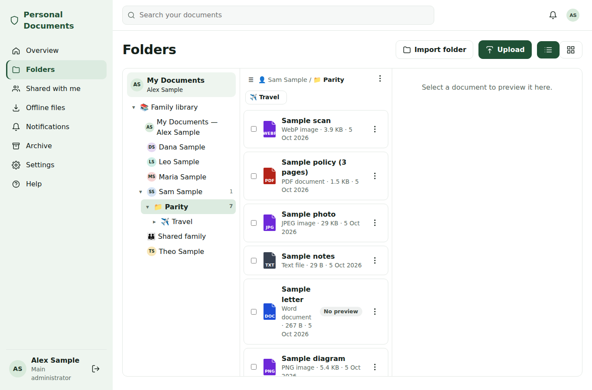
*Folder browser: your own area at the top, labelled file types, sub-folders and a ⋮ menu on every row (synthetic data).*

## Contents

- [Features](#features)
- [Screenshots](#screenshots)
- [Architecture](#architecture)
- [Requirements](#requirements)
- [Install on Debian 13 / Proxmox LXC](#install)
- [Reverse proxy and first-run setup](#reverse-proxy-and-first-run-setup)
- [Upgrade, backup and restore](#upgrade-backup-and-restore)
- [Development and testing](#development-and-testing)
- [Documentation](#documentation)
- [Security](#security) · [Contributing](#contributing) · [License](#license) · [Author](#author)

## Features

**Library**
- Six family accounts created by a one-time setup wizard, plus extended-family groups with heads and scoped delegation.
- Default-deny permissions with nine capabilities, folder inheritance, per-document exceptions and a "why can this
  person see it" view, enforced on every server route.
- Folders of any depth. Each person's own area is marked **My Documents**, and every row shows a file-type icon
  (PDF, JPG, PNG, WEBP, TXT, DOC, XLS, PPT, ZIP, DCM) taken from the file's real content.
- **Drag and drop** for documents and folders, plus a **Move to…** folder picker for touch screens and keyboards.
  Moves are atomic, so a refused move never loses or duplicates anything.
- Byte-identical originals with SHA-256 checksums, immutable versions, renewals as linked records, and archive with
  restore and purge.

**Processing and viewing**
- Local OCR with Tesseract/OCRmyPDF (searchable PDF/A), LibreOffice previews, thumbnails and DICOM-safe storage.
- Built-in viewer for PDFs and images: zoom (25–400 %), fit page, fit width, 100 %, page navigation, full screen
  and keyboard shortcuts. Documents are never sent to an outside viewer.
- Suggested details (including passport MRZ check digits) that only rename documents or schedule reminders after a
  person confirms them.
- Full-text search with highlights, saved views and a non-AI "More like this".

**Import, reminders and notifications**
- Folder import from a browser or an approved NAS path. You map each source folder to a person, an existing
  sub-folder or a shared folder, and the preview shows the exact final hierarchy (new vs existing folders) before
  anything is imported.
- Expiry reminders (90/60/30/7/0 days) in-app, by email and by Telegram.
- **Critical notifications** that members cannot turn off (security changes, failed backups and similar). Missing
  destinations are flagged, never reported as delivered.
- **Optional notifications** chosen per event and per channel.
- Consistent message templates, and one summary for bulk uploads and imports.
- Expiring, password-protected share links and native device sharing.

**Security**
- Passwords, TOTP that works with password managers, passkeys (second step or passwordless), recovery codes,
  optional Google sign-in, and an audited server-console recovery.
- Login audit with the real client IP behind trusted proxies, local GeoIP, country allow/block lists with temporary
  travel access, and trusted/blocked IPs with lock-out protection.
- Security alerts and privacy-safe traffic analytics (GoAccess).

**Local AI (optional, off by default)**
- OCR assist, smart organisation suggestions, a document assistant and semantic search, using your own LM Studio or
  Ollama server.
- Permission-filtered, suggestions only, and never a cloud fallback.

**Operations**
- Installable PWA with camera upload, per-account offline copies and streaming ZIP exports.
- Three themes, and dashboard widgets you choose and order. Account settings follow you to every device.
- NAS backups (daily, weekly or monthly) with verification and retention, console restore, an integrity checker,
  an audit log and a health page.
- One `personaldocs` command for install, upgrade, rollback, repair and diagnostics.

Not included: personal WhatsApp notifications (planned) and any cloud storage.

## Screenshots

All screenshots show the real application with synthetic people (the "Sample" family) and synthetic files. They are
regenerated by the browser tests (`scripts/e2e.sh`).

| | |
|---|---|
| 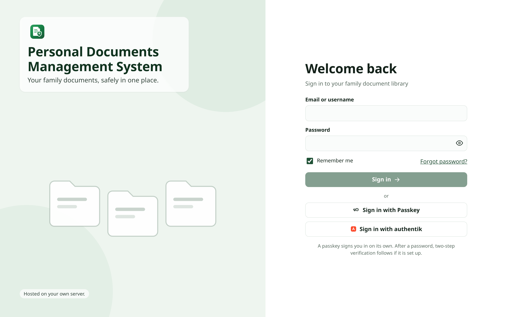 *Sign-in (password, passkey or Google)* | 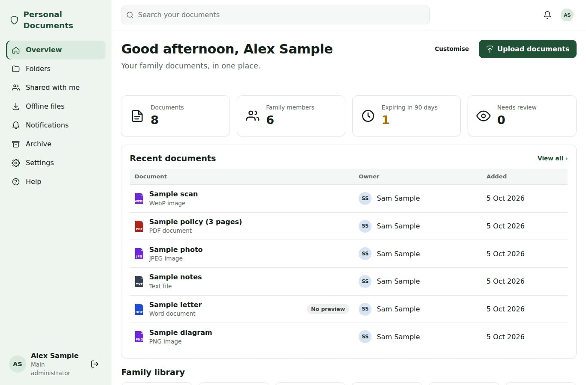 *Dashboard with the widgets you chose* |
| 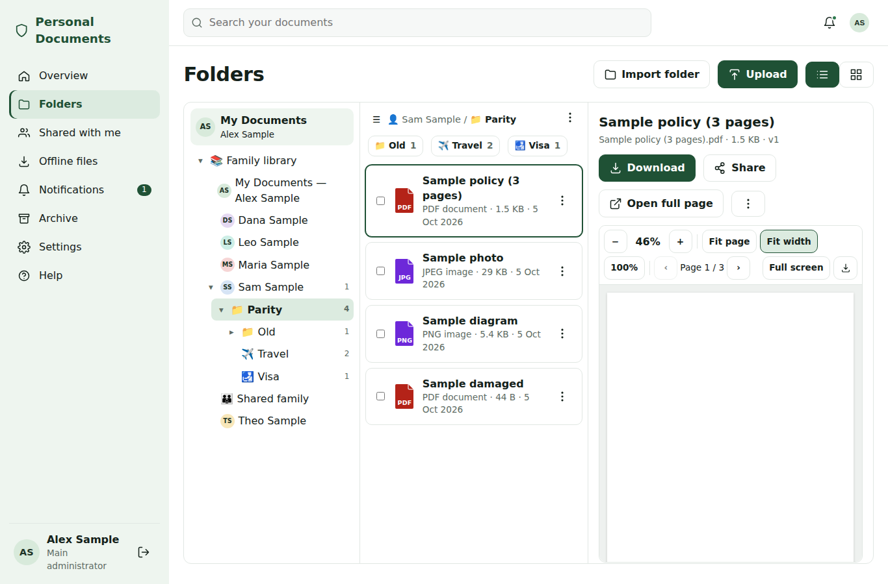 *Three-panel browser with the built-in viewer* | 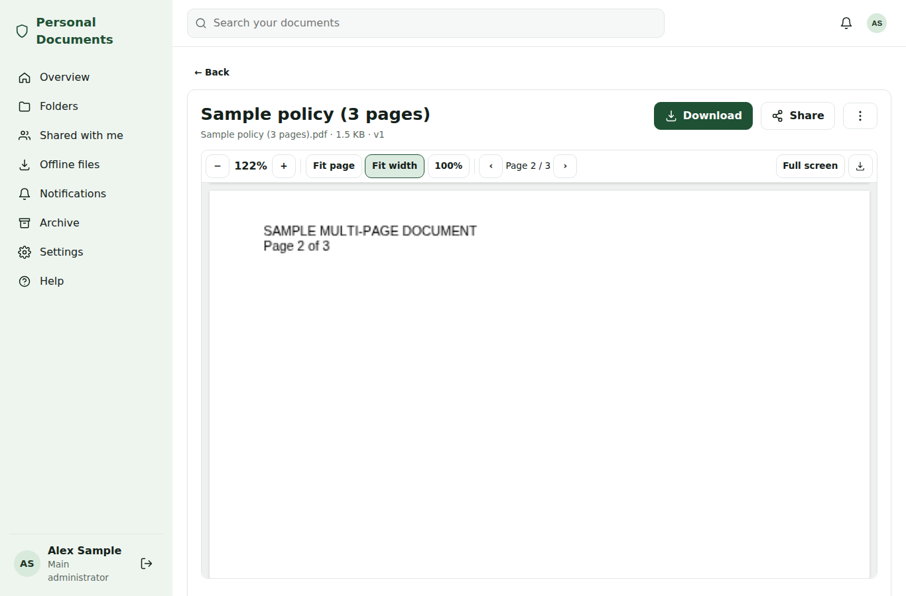 *Full-page viewer: zoom, fit page/width, pages* |
| 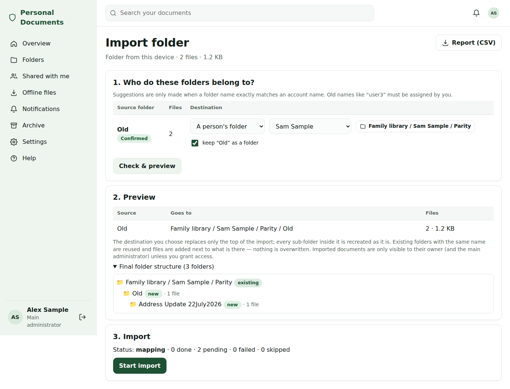 *Import: destination sub-folder and final structure* | 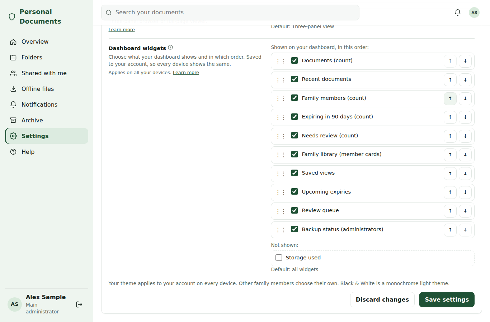 *Settings: pick and order dashboard widgets* |
| 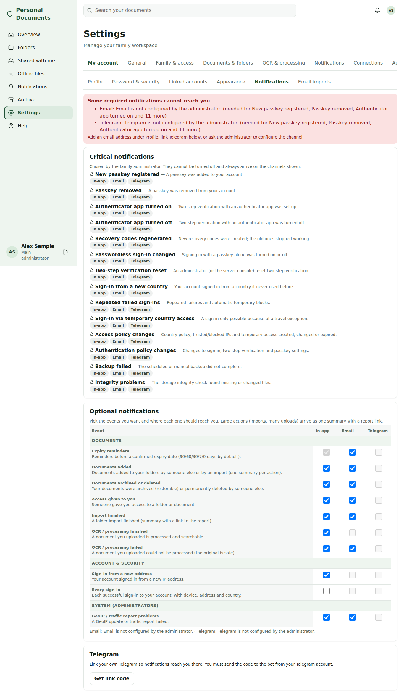 *Critical and optional notifications per channel* | 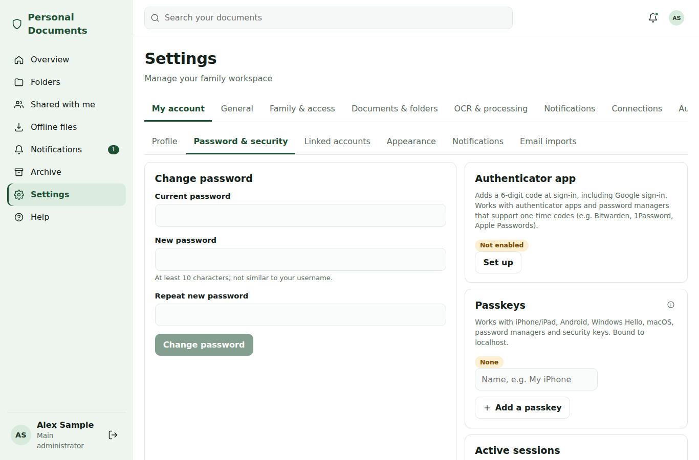 *Password, authenticator app and passkeys* |
| 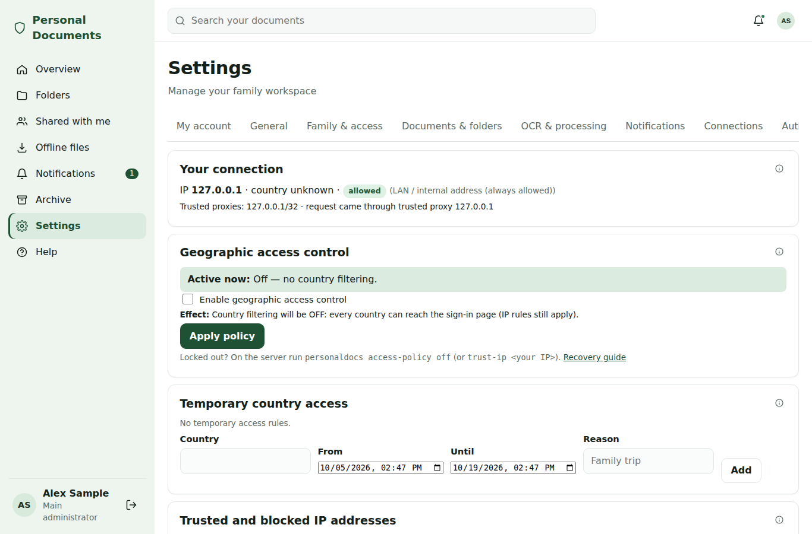 *Country/IP access policy and GeoIP* | 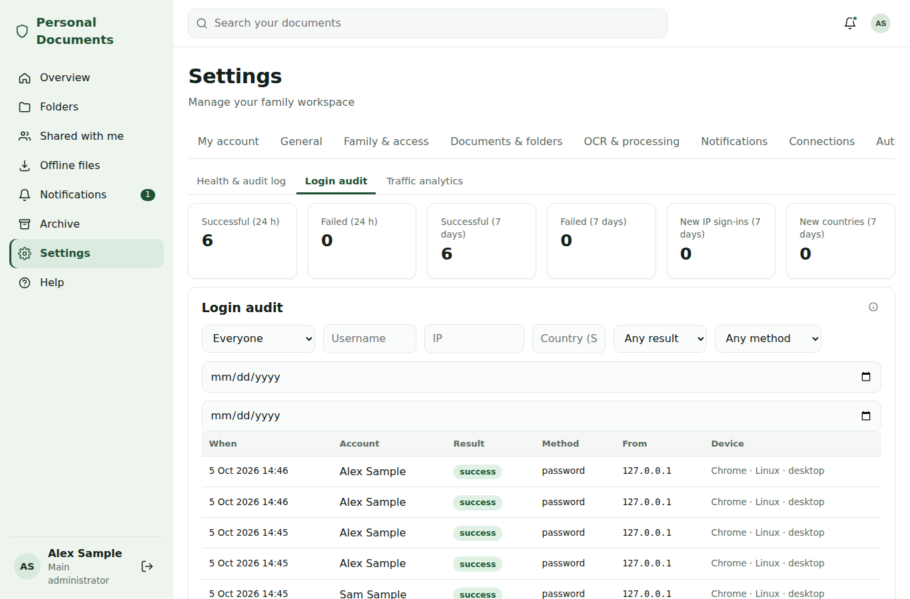 *Login audit* |
| 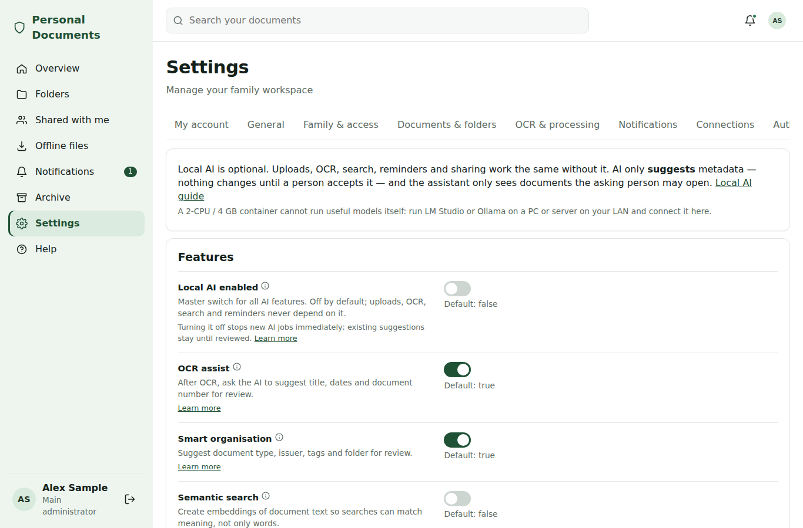 *Local AI profiles (optional)* | 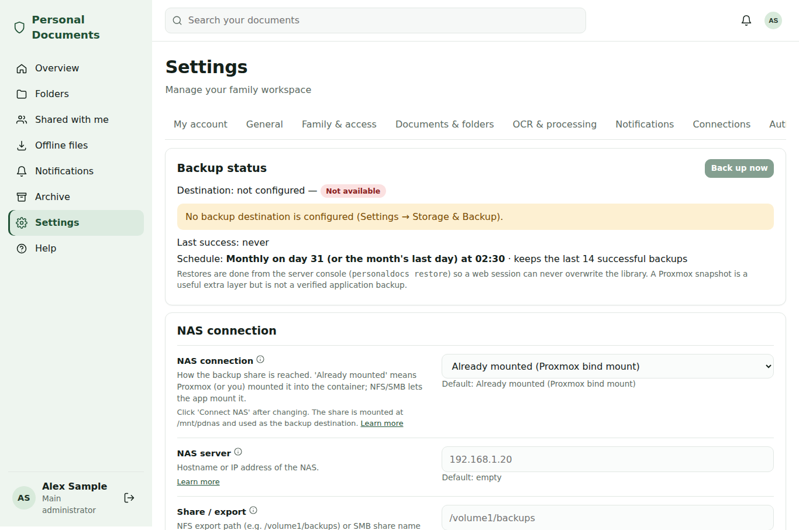 *Daily / weekly / monthly backups* |
| 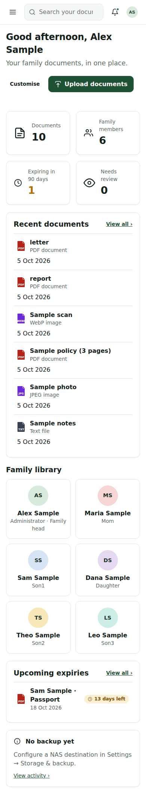 *Phone: dashboard* | 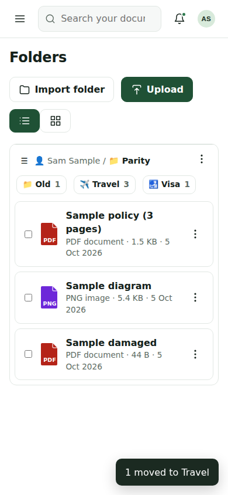 *Phone: folders and Move to…* |
| 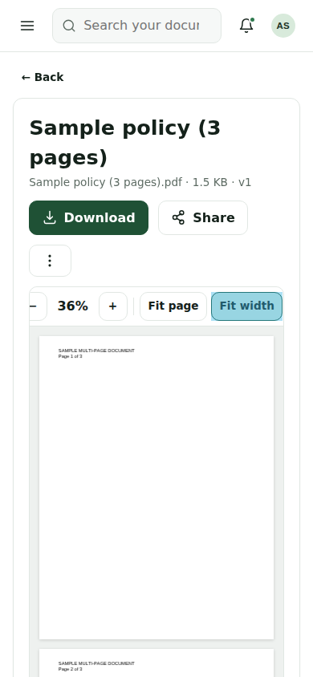 *Phone: viewer toolbar* | |

## Architecture

```
Internet → Nginx Proxy Manager / Pangolin (HTTPS) → country/IP access policy → rate limits
        → Personal Documents (Django + React PWA) → per-document permissions → audit log
                     │
                     ├─ PostgreSQL (metadata, search, settings, audit)
                     ├─ worker: OCR, previews, imports, AI jobs (bounded concurrency)
                     ├─ scheduler: reminders, notifications, backups, GeoIP, traffic reports
                     └─ storage: originals + derivatives on the LXC disk; backups on a mounted NAS
```

It is a Django 5.2 modular monolith with a React/TypeScript single-page app, run by systemd units (`personaldocs-web`,
`-worker`, `-scheduler`). Details are in [docs/ARCHITECTURE.md](docs/ARCHITECTURE.md) and the
[decision records](docs/adr/).

## Requirements

- Proxmox VE with a **Debian 13** LXC: 2 vCPU, 4 GB RAM and 50 GB disk to start. The container needs nesting for
  service isolation; NFS/SMB mounting from the app needs a privileged container.
- A domain and HTTPS through **Nginx Proxy Manager** or **Pangolin**.
- Optional: a NAS share for backups, an SMTP account, a Telegram bot, a MaxMind GeoLite2 licence (free), and a LAN
  PC running LM Studio or Ollama for Local AI.

## Install

On the Proxmox host, `scripts/proxmox-create-lxc.sh` can create the container. Then, inside the Debian 13
container, as root:

```bash
apt-get update && apt-get install -y git
git clone https://github.com/atikansari-ghr/Personal-DM.git /root/personaldocs-src
cd /root/personaldocs-src && bash scripts/easy-install.sh
```

The guided installer:
- checks CPU, memory, disk and network
- asks for the domain, the reverse proxy address, the NAS and the backup time
- installs everything (PostgreSQL, Tesseract, LibreOffice, GoAccess, a Python virtualenv and the built web app)
- connects the NAS and runs a first backup and health check

For a private fork, see [private GitHub access](docs/guides/private-github.md). Full details are in the
[installation guide](docs/guides/installation.md).

## Reverse proxy and first-run setup

1. Point the proxy host at `http://<container-ip>:8000` and set `PD_TRUSTED_PROXY_IPS` to the proxy's address so
   real client IPs are logged ([reverse proxy](docs/guides/reverse-proxy.md),
   [real client IP](docs/guides/security-access.md#real-ip)).
2. Open the HTTPS address and enter the one-time setup code printed by the installer (`personaldocs setup-token`
   prints a new one).
3. The wizard creates the family accounts. Everyone signs in and chooses their own password; passkeys and an
   authenticator app can be added under **My account**.

Use `sudo personaldocs check-access` when the site cannot be reached.

## Upgrade, backup and restore

```bash
sudo personaldocs upgrade          # verified backup → fetch → build → migrate → restart → health check
sudo personaldocs repair           # safe; never resets data or keys
sudo personaldocs doctor           # proxy, GeoIP, passkey origin, AI, storage and service checks
sudo personaldocs status | backup | restore DIR | rollback | recover-admin USER [--reset-2fa]
sudo personaldocs access-policy status | off | rollback   # country/IP policy recovery from the console
```

- Backups go to a mounted NAS on a daily, weekly or monthly schedule and are verified after writing.
- Restores are done from the server console, so a web session can never overwrite the library.

See the [upgrade guide](docs/guides/upgrades.md) and [backup & restore](docs/guides/backup-restore.md).

## Development and testing

Requirements: Python 3.13, Node 22, PostgreSQL 15+, and optionally `tesseract-ocr ocrmypdf libreoffice-writer poppler-utils`.

```bash
python3.13 -m venv .venv && .venv/bin/pip install -r backend/requirements-dev.txt
(cd frontend && npm ci && npm run build)
sudo -u postgres psql -c "CREATE ROLE personaldocs LOGIN CREATEDB PASSWORD 'devpass'" -c "CREATE DATABASE personaldocs OWNER personaldocs"
export PD_DEBUG=1 PD_DB_PASSWORD=devpass PD_DATA_DIR=/tmp/pd-dev/data PD_CONFIG_DIR=/tmp/pd-dev/config
scripts/dev-server.sh                                       # web on :8000 + worker
(cd backend && ../.venv/bin/python manage.py setup_token)   # then open http://localhost:8000
```

Before every push:

```bash
scripts/verify.sh          # compile, Django checks, migrations, settings reference, shellcheck, pytest,
                           # frontend type check and build, privacy/authorship/link check
scripts/e2e.sh             # browser flow, accessibility audit (3 themes) and desktop/tablet/phone parity checks
```

All test data is synthetic. See [testing](docs/guides/testing.md) and [CONTRIBUTING.md](CONTRIBUTING.md).

## Documentation

| Document | For |
|---|---|
| [User guide](docs/USER_GUIDE.md) | Everyone in the family |
| [Administrator guide](docs/ADMIN_GUIDE.md) | Whoever runs the server |
| [Guides](docs/guides/) | Topic guides, also bundled in the app under Help |
| [Settings reference](docs/SETTINGS_REFERENCE.md) | Every setting (generated) |
| [Requirements](docs/REQUIREMENTS.md), [traceability](docs/TRACEABILITY.md) | Requirement → code → test → document |
| [Architecture](docs/ARCHITECTURE.md), [decisions](docs/adr/) | Maintainers |
| [Implementation status](docs/IMPLEMENTATION_STATUS.md), [test report](docs/TEST_REPORT.md) | What is done and verified |
| [Release checklist](docs/RELEASE_CHECKLIST.md), [changelog](CHANGELOG.md) | Releasing |

## Security

Please do not open public issues for vulnerabilities. See [SECURITY.md](SECURITY.md) for how to report them privately
and for what the project does and does not protect against.

## Contributing

Contributions are welcome. See [CONTRIBUTING.md](CONTRIBUTING.md). The most important rule: **only synthetic
data**. Never commit real documents, names, OCR text, databases, backups, keys, tokens or screenshots of a real
installation.

## License

**No license has been chosen yet.** Until the author publishes one, the code is "all rights reserved": you may read
it, but you may not reuse it without permission. Third-party components keep their own licences (for example
Django, React and PDF.js, see their package metadata).

## Author

**Atik Ansari** — author and maintainer.
