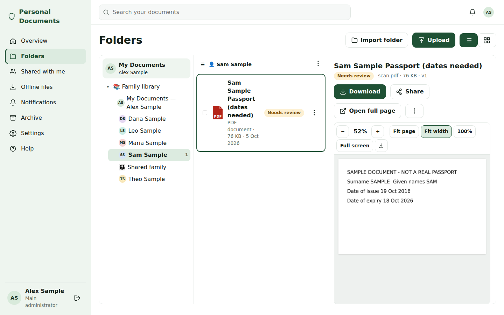

# Personal Documents

A private, self-hosted document library for a family and extended relatives: passports, visas, residence permits, ID cards, certificates, property papers, medical records and more. It runs natively on a Proxmox LXC (Debian 13) behind Nginx Proxy Manager or Pangolin. There is no Docker and no cloud dependency.



## Features (initial release)

- **Family accounts**: six initial accounts set up by a one-time wizard, plus extended-family groups with heads and scoped delegation. Every person has their own account.
- **Permissions**: default-deny with nine capabilities (view, download, upload, edit, version, organise, archive, share, manage). Folder rules are inherited, document-level exceptions are supported, and a "why does this person have access" view is built in. Enforced server-side on every route.
- **Library**: arbitrary-depth folders with suggested emoji, originals stored byte-for-byte with SHA-256 checksums, immutable versions, renewals stored as separate linked records, and archive with administrator-only restore and purge.
- **Local processing**: Tesseract/OCRmyPDF OCR producing searchable PDF/A copies, LibreOffice previews for Office files, thumbnails, and safe handling of DICOM and unknown formats.
- **Details**: proposed values from deterministic parsing (including passport MRZ check digits) with discrepancy flags. Nothing is used for names or reminders until a person confirms it. Copy buttons for filling in forms.
- **Search**: PostgreSQL full-text search with highlights, autocomplete, saved views and a non-AI "More like this".
- **Imports**: browser folder upload and approved server/NAS paths, with explicit source-folder-to-person mapping, resumable and idempotent. Server imports never modify the source.
- **Reminders**: 90/60/30/7/0-day expiry schedule over in-app, SMTP email and Telegram, with deduplicated recipients and idempotent delivery. Messages carry minimal content.
- **Sharing**: expiring, password-protected public links pinned to one version, plus native device sharing.
- **Mobile**: installable PWA, camera/file upload, opt-in offline copies partitioned per account, and streaming ZIP exports with checksums.
- **Sign-in**: local passwords, optional TOTP with recovery codes, optional linked Google sign-in (OIDC + PKCE, no auto-registration), and audited console recovery for the main administrator.
- **Operations**: application-level NAS backups with verification, console restore, integrity checker, audit log, health page, and a single `personaldocs` command for install/upgrade/rollback/repair.
- **Themes and help**: Green & White, Blue & White and Black & White themes per account. All help is bundled inside the app.

Later phases (not in this release): local AI assistance and personal WhatsApp notifications. See [Settings → Future features](docs/guides/settings.md#future).

## Production quick start (Debian 13 LXC)

Inside the Debian 13 container, as root:

```bash
apt-get update && apt-get install -y git
git clone https://github.com/OWNER/REPO.git /root/personaldocs-src   # password prompt: your read-only GitHub token
cd /root/personaldocs-src && bash scripts/easy-install.sh
```

The script checks CPU, memory, disk and network, asks for the domain, reverse proxy, NAS and backup time, installs all dependencies
and completes the installation. See [installation](docs/guides/installation.md#guided) and [private GitHub access](docs/guides/private-github.md).

Manual alternative:

```bash
apt-get update && apt-get install -y git ca-certificates curl
install -d -m 700 /etc/personaldocs
read -rsp "GitHub read-only token: " T && printf '%s' "$T" > /etc/personaldocs/github-token && chmod 600 /etc/personaldocs/github-token; unset T; echo
git -c credential.helper='!f(){ echo username=x-access-token; echo password=$(cat /etc/personaldocs/github-token); }; f' \
    clone https://github.com/OWNER/REPO.git /root/personaldocs-src
/root/personaldocs-src/scripts/personaldocs install --public-origin https://docs.example.com
```

Then point your reverse proxy at the container ([guide](docs/guides/reverse-proxy.md)), open the address, and enter the printed setup code. Later updates are a single command:

```bash
sudo personaldocs upgrade          # backup → update → migrate → restart → health check
sudo personaldocs repair           # safe, never resets data or keys
sudo personaldocs status | doctor | backup | restore DIR | recover-admin dad
```

## Local development

Requirements: Python 3.13, Node 20+, PostgreSQL 15+, and optionally `tesseract-ocr ocrmypdf libreoffice-writer poppler-utils`.

```bash
python3.13 -m venv .venv && .venv/bin/pip install -r backend/requirements-dev.txt
(cd frontend && npm ci && npm run build)
sudo -u postgres psql -c "CREATE ROLE personaldocs LOGIN CREATEDB PASSWORD 'devpass'" -c "CREATE DATABASE personaldocs OWNER personaldocs"
export PD_DEBUG=1 PD_DB_PASSWORD=devpass PD_DATA_DIR=/tmp/pd-dev/data PD_CONFIG_DIR=/tmp/pd-dev/config
scripts/dev-server.sh                                  # web on :8000 + worker
(cd backend && ../.venv/bin/python manage.py setup_token)   # then open http://localhost:8000
```

For frontend hot reload, run `npm run dev` in `frontend/` (it proxies `/api` to :8000).

Run every check before pushing:

```bash
scripts/verify.sh          # compile, checks, migrations, settings reference, shell, pytest, frontend build, hygiene
```

## Documentation

| Document | Contents |
|---|---|
| [docs/guides/](docs/guides/) | User and administrator guides (also bundled in the app's Help) |
| [docs/REQUIREMENTS.md](docs/REQUIREMENTS.md) | Consolidated requirements with IDs |
| [docs/TRACEABILITY.md](docs/TRACEABILITY.md) | Requirement → code → test → doc → status |
| [docs/ARCHITECTURE.md](docs/ARCHITECTURE.md), [docs/adr/](docs/adr/) | Architecture and decisions |
| [docs/IMPLEMENTATION_STATUS.md](docs/IMPLEMENTATION_STATUS.md) | What is done, blockers, next steps |
| [docs/TEST_REPORT.md](docs/TEST_REPORT.md) | Environments, commands, results, untested items |
| [docs/SETTINGS_REFERENCE.md](docs/SETTINGS_REFERENCE.md) | Every setting (generated) |
| [docs/RELEASE_CHECKLIST.md](docs/RELEASE_CHECKLIST.md), [CHANGELOG.md](CHANGELOG.md) | Releasing |

## Privacy rules for contributors

Use synthetic data only. Never commit real documents, names, OCR text, databases, backups, keys or tokens. The `references/` folder (original planning material) is git-ignored.
