# Personal Documents Management System

[](https://github.com/atikansari-ghr/Personal-DM/actions/workflows/ci.yml)


[](LICENSE)
[](https://ko-fi.com/atikansari)

**Your family's passports, visas, IDs, certificates and property papers in one private library, on your own
server.** Each person gets a personal area with fine-grained sharing. Scans are read locally with OCR, so expiry
dates turn into reminders. Everything works from a phone as an installable app, with no cloud service, no
subscription, and no document ever leaving your hardware.

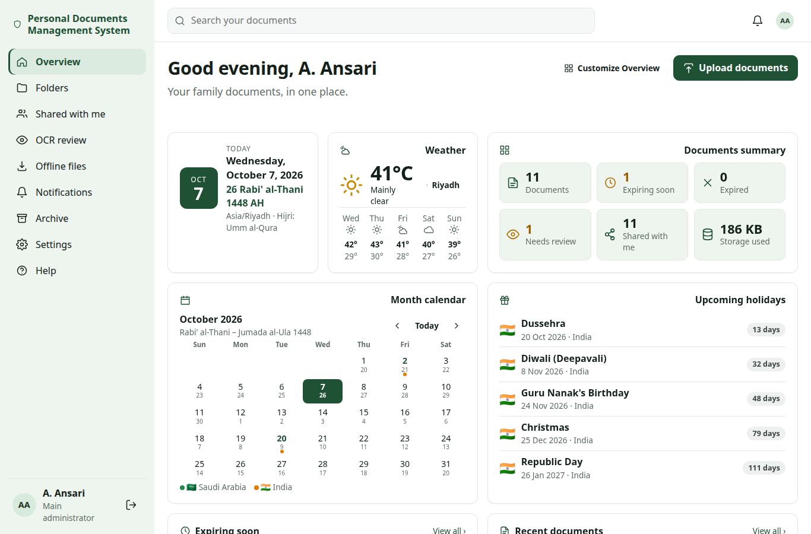
*Overview: Gregorian and Hijri date, weather, documents summary, month calendar with Saudi and Indian holidays (synthetic data).*

| | |
|---|---|
|  *Three-panel folder browser with file-type icons* | 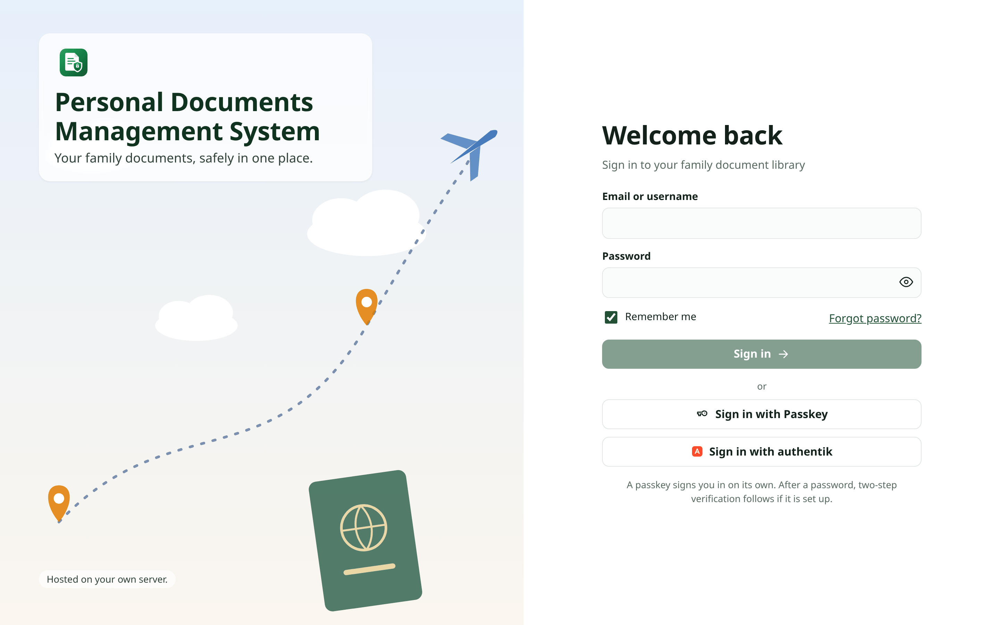 *Sign-in page, Travel design* |
| 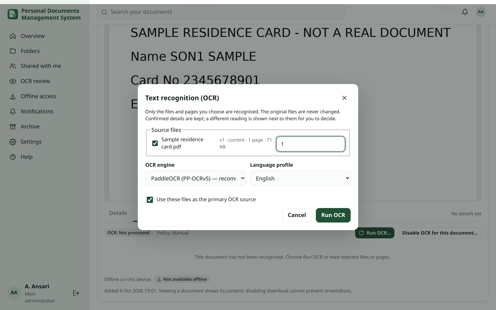 *Selective OCR: choose files, pages and languages* | 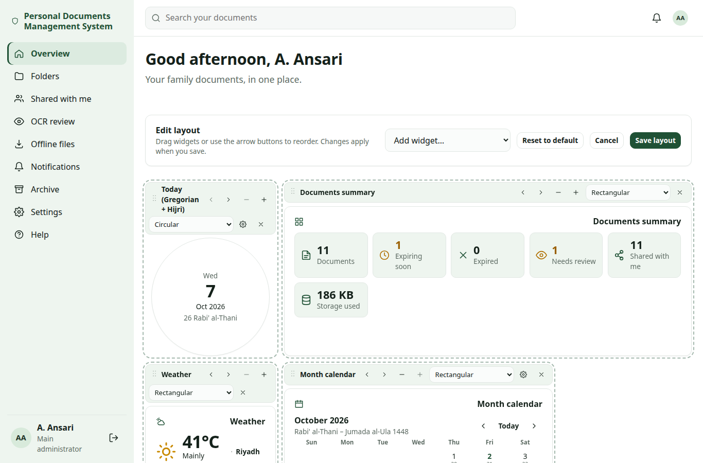 *Customize Overview: reorder, resize, style* |

## Install in one line

On a fresh **Debian 13** server, VM or Proxmox LXC, as **root**:

```bash
bash -c "$(curl -fsSL https://raw.githubusercontent.com/atikansari-ghr/Personal-DM/main/personal-DM.sh)"
```

The script shows a menu: install, upgrade, repair, health check, status, backup, restore and administrator
recovery. Each one is also available as a command for scripts, for example
`bash -c "$(curl -fsSL …/personal-DM.sh)" -- upgrade`. More details are in [Install](#install).

> **Status:** version 0.1.0, pre-release, built and maintained by one person. Every feature below is implemented
> and covered by automated tests. Checks that need real hardware or accounts (Proxmox, a NAS, SMTP/Telegram,
> MaxMind, real phones, passkeys on real devices, a full install on a Debian 13 machine) are listed as pending in
> [docs/TEST_REPORT.md](docs/TEST_REPORT.md). Read [docs/IMPLEMENTATION_STATUS.md](docs/IMPLEMENTATION_STATUS.md)
> before trusting it with real family documents.

## Contents

- [Why](#why) · [Features](#features) · [Screenshots](#screenshots) · [Architecture](#architecture)
- [Install](#install) · [Reverse proxy and first-run setup](#reverse-proxy-and-first-run-setup)
  · [Upgrade, backup and restore](#upgrade-backup-and-restore)
- [Security and privacy](#security-and-privacy) · [OCR and AI](#ocr-and-ai) · [Mobile and PWA](#mobile-and-pwa)
- [Development and testing](#development-and-testing) · [Documentation](#documentation) · [Roadmap](#roadmap)
- [Support](#support) · [Contributing](#contributing) · [License](#license) · [Author](#author)

## Why

Families keep their most important papers in a mix of drawers, e-mail attachments, phone galleries and cloud drives.
Nobody knows which passport expires next, and there is no safe way to give a relative access to only one folder.
This project gives every member their own library and lets the family share only what it chooses. Renewal dates
come from the documents themselves, and everything runs on a small server you control.

## Features

**Library**
- A one-time setup wizard creates only the Main Administrator; family members are added optionally during setup
  or later. Extended-family groups with heads and scoped delegation.
- Default-deny permissions with nine capabilities, folder inheritance, per-document exceptions and a "why can this
  person see it" view, enforced on every server route.
- Folders of any depth. Each person's own area is marked **My Documents**, and every row shows a file-type icon
  (PDF, JPG, PNG, WEBP, TXT, DOC, XLS, PPT, ZIP, DCM) taken from the file's real content.
- **Drag and drop** for documents and folders, plus a **Move to…** folder picker for touch screens and keyboards.
  Moves are atomic, so a refused move never loses or duplicates anything.
- **Drop files or whole folders from your desktop** (Windows Explorer, Finder, Linux file managers). The folder
  structure is recreated below the drop target, with progress and a per-file report.
- **List, Thumbnails and Details views** with sorting by name, date, size, expiry or type. The choice is saved to
  your account and follows you to every device.
- **⋮ menus** on every document and folder: rename, move, download, share, change icon, archive, and permanent
  delete (administrator only). Menus only list what you are allowed to do.
- Byte-identical originals with SHA-256 checksums, immutable versions, renewals as linked records, and archive with
  restore and purge.

**Processing and viewing**
- **Selective OCR**: per document type the administrator chooses Disabled, Manual (default) or Automatic. You pick
  the files (front and back of a card as one job), the pages or ranges and the languages (English, Arabic, Hindi
  and more) and can remove OCR data again without touching the original. An OCR review queue lists what waits for
  confirmation, and the local AI only reads document types that allow it.
- Local OCR with Tesseract/OCRmyPDF (searchable PDF/A), with measured preprocessing: phone-photo orientation,
  upside-down and sideways scans, deskew, contrast and denoise. On the synthetic benchmark, mean accuracy went from
  0.61 to 0.97 ([OCR benchmark](docs/OCR_BENCHMARK.md)). Confidence is shown per document and unreliable lines are
  greyed out.
- LibreOffice previews, thumbnails and DICOM-safe storage.
- Built-in viewer for PDFs and images: zoom (25–400 %), fit page, fit width, 100 %, page navigation, full screen
  and keyboard shortcuts. Documents are never sent to an outside viewer.
- Suggested details (passport MRZ check digits, card layouts such as "Badge No | Expiry Date", "No Expiry Date")
  that only rename documents or schedule reminders after a person confirms them. Re-running OCR never overwrites
  a confirmed value.
- Full-text search with highlights, saved views and a non-AI "More like this".

**Import, reminders and notifications**
- Folder import from a browser or an approved NAS path. You map each source folder to a person, an existing
  sub-folder or a shared folder, and the preview shows the exact final hierarchy (new vs existing folders) before
  anything is imported.
- Expiry reminders (90/60/30/7/0 days) in-app, by email and by Telegram.
- **Critical notifications** that members cannot turn off (security changes, failed backups and similar). Missing
  destinations are flagged, never reported as delivered.
- **Optional notifications** chosen per event and per channel.
- Consistent message templates, and one summary for bulk uploads and imports.
- Expiring, password-protected share links and native device sharing.

**Security**
- **Antivirus:** every new file is scanned in the background by a local ClamAV daemon; threats are quarantined and
  blocked from preview, download, OCR and AI until the main administrator reviews them. Signatures update
  automatically, and the existing library can be re-scanned on demand or on a schedule.
- **Security center** for administrators: a Security Health score, an Internet Ready (HTTPS) check, a manual Basic
  Internet Security Test of the application and its host, controlled Debian security updates with a backup first
  and a safe reboot, read-only firewall monitoring, security-record retention and Storage Health.
- Passwords, TOTP that works with password managers, passkeys (second step or passwordless), recovery codes,
  optional Google or **authentik** (OpenID Connect) sign-in with explicit account linking, and an audited
  server-console recovery.
- Login audit with the real client IP behind trusted proxies, local GeoIP, country allow/block lists with temporary
  travel access, and trusted/blocked IPs with lock-out protection.
- Security alerts and privacy-safe traffic analytics (GoAccess).

**Local AI (optional, off by default)**
- OCR assist, smart organisation suggestions, a document assistant and semantic search, using your own LM Studio or
  Ollama server.
- Permission-filtered, suggestions only, and never a cloud fallback.

**Operations**
- Installable PWA with camera upload, per-account offline copies and streaming ZIP exports.
- A customizable **Overview**: Gregorian + Hijri (Umm al-Qura) date, weather for your city (optional, Open-Meteo,
  cached), documents summary, month calendar and upcoming public holidays (Saudi Arabia and India by default, any
  of 250 countries, with administrator corrections), shared documents and recent activity. Add, remove, drag or
  keyboard-reorder, resize and choose rectangular, compact or circular styles; the layout follows you to every device.
- Sign-in page designs (Minimal, Nature, Travel, Family, Neutral) or your own wallpaper, title, tagline and logo.
- Three colour themes. Account settings follow you to every device.
- NAS backups (daily, weekly or monthly) with verification and retention, console restore, an integrity checker,
  an audit log and a health page.
- One `personaldocs` command for install, upgrade, rollback, repair and diagnostics.

Not included: personal WhatsApp notifications (planned) and any cloud storage.

## Screenshots

All screenshots show the real application with demo data only. The administrator is labelled **A. Ansari** and
the family members **Mom**, **Son1**, **Son2**, **Son3** and **Daughter**; these demo accounts were added in the
optional setup step for the pictures and are never created by the application. All files are synthetic. The
screenshots are regenerated by the browser tests (`scripts/e2e.sh`) at 1440 × 900 (desktop) and 390 × 844 (phone).

### Overview and sign-in

| | |
|---|---|
|  *Overview with the suggested widgets* |  *Customize Overview: add, remove, reorder, resize, style* |
| 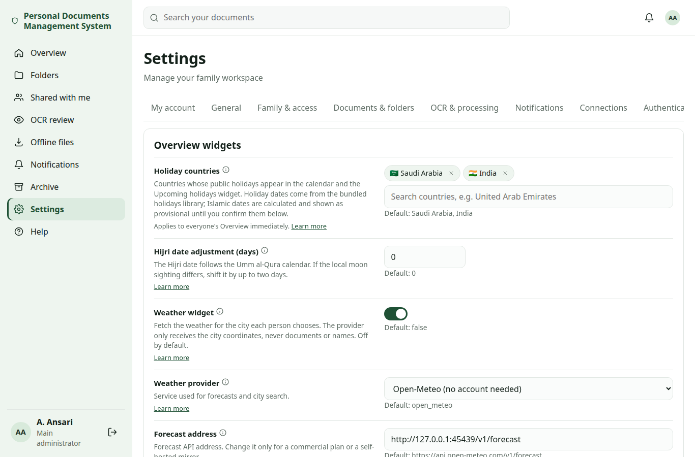 *Holiday countries, weather and holiday corrections* | 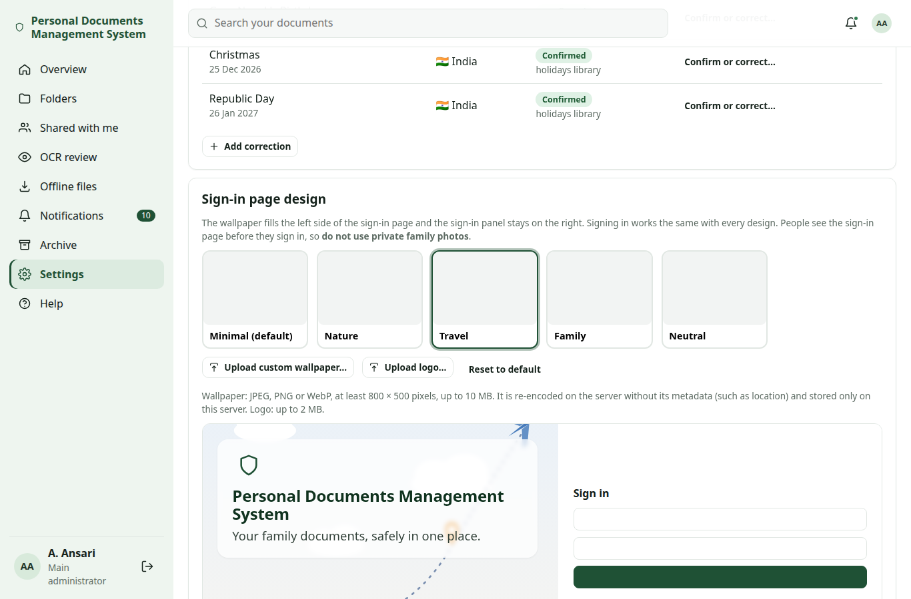 *Choosing the sign-in design* |
|  *Sign-in, Minimal design (default)* | 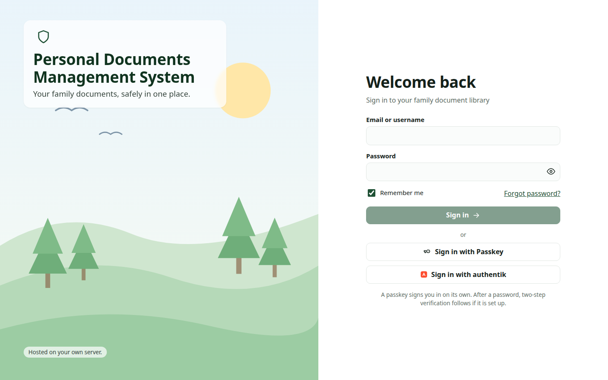 *Sign-in, Nature design* |
|  *Sign-in, Travel design* | 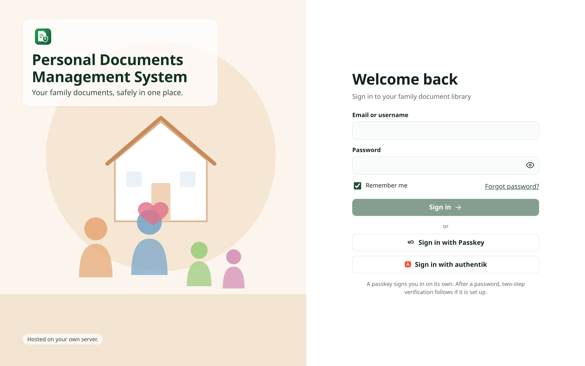 *Sign-in, Family design* |

### Documents and folders

| | |
|---|---|
|  *Three-panel folder browser with file-type icons* |  *Three-panel browser with the built-in viewer* |
| 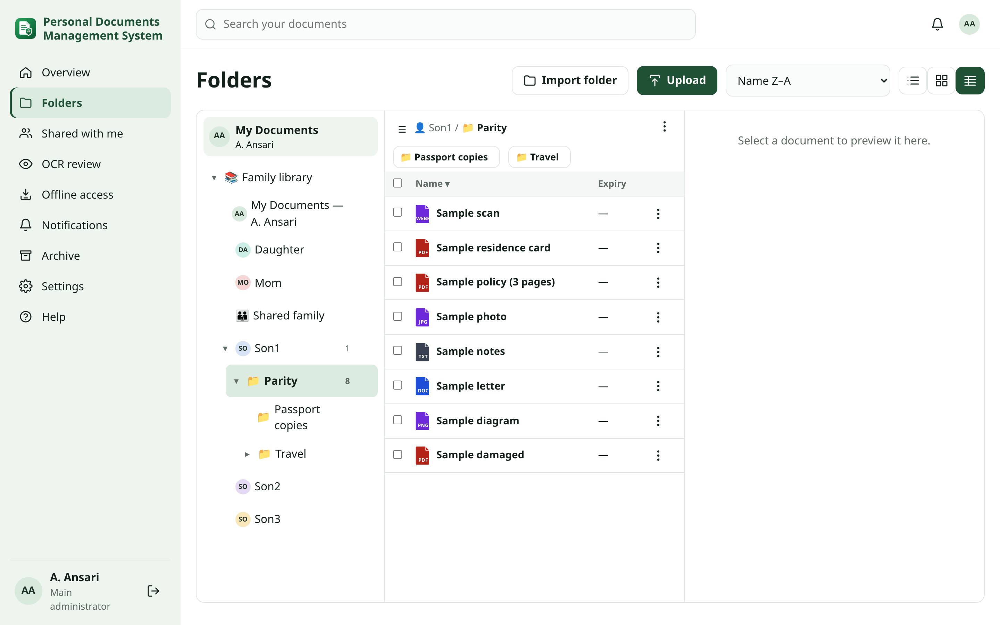 *Details view with sortable columns* |  *Full-page viewer: zoom, fit page/width, pages* |
| 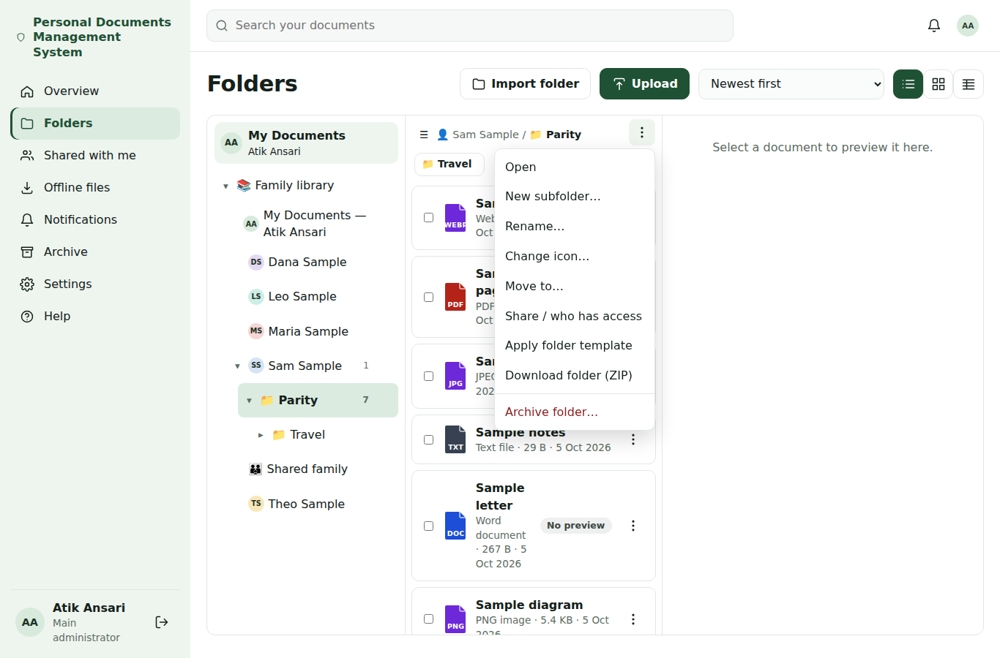 *Folder actions: rename, icon, move, share, archive* | 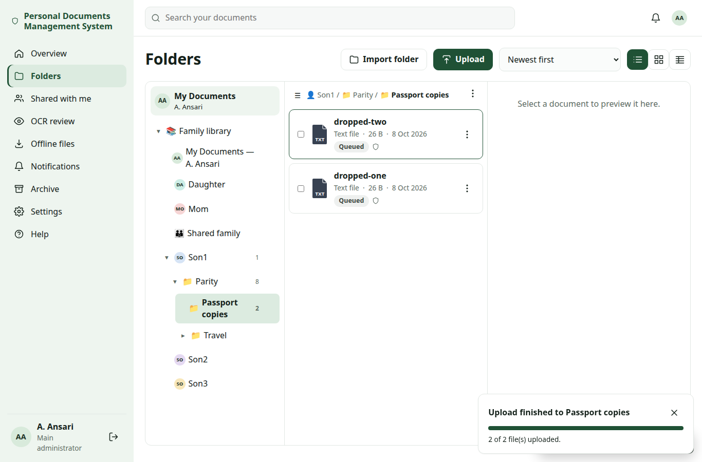 *Files dropped from the desktop, with a per-file report* |
|  *Import: destination sub-folder and final structure* |  *Critical and optional notifications per channel* |

### Selective OCR

| | |
|---|---|
|  *Run OCR on chosen files, pages and languages* | 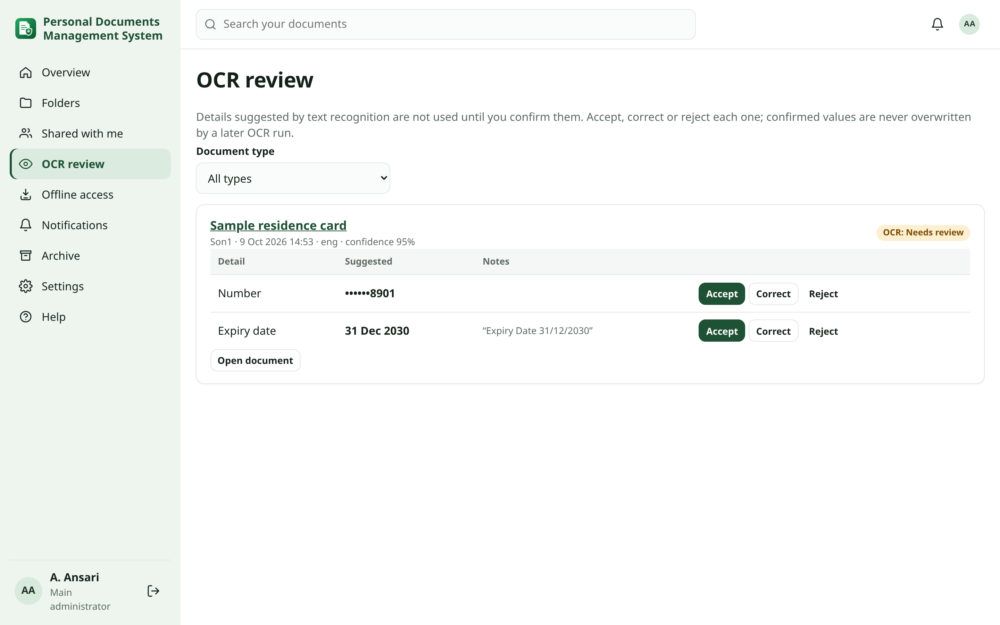 *OCR review queue: accept, correct or reject* |

### Security and administration

| | |
|---|---|
| 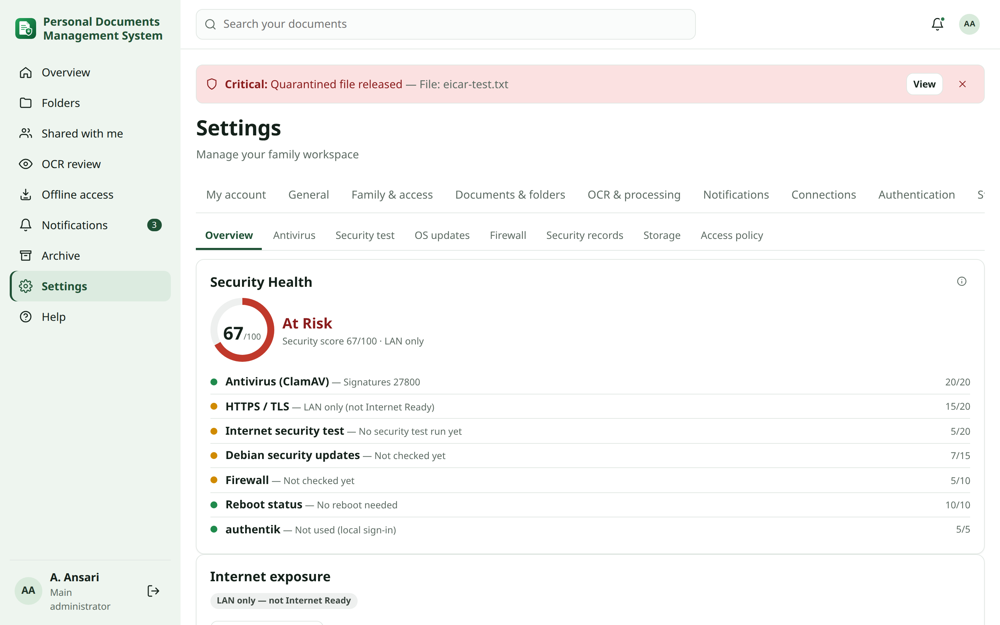 *Security Health score and Internet exposure* | 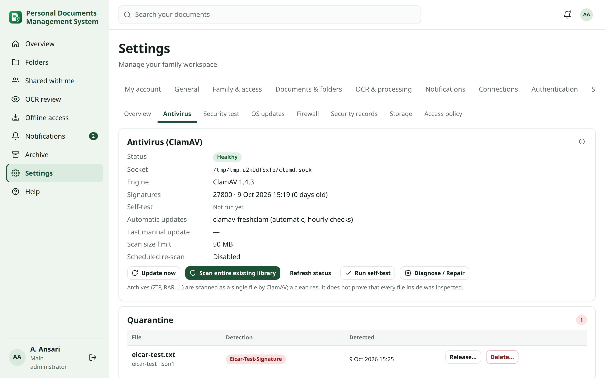 *ClamAV antivirus and quarantine (EICAR test file)* |
| 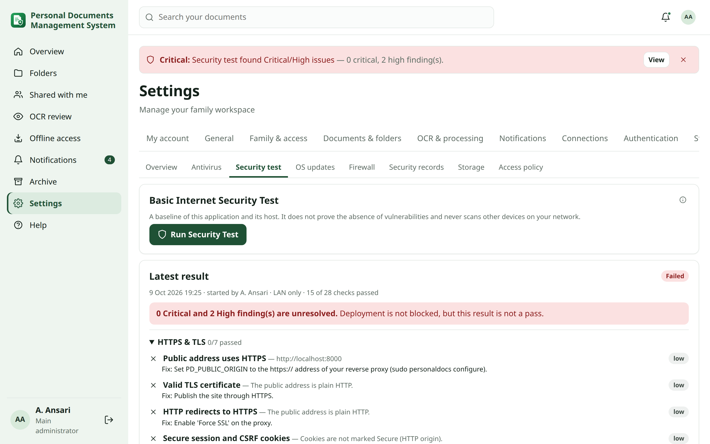 *Basic Internet Security Test with severities and fixes* | 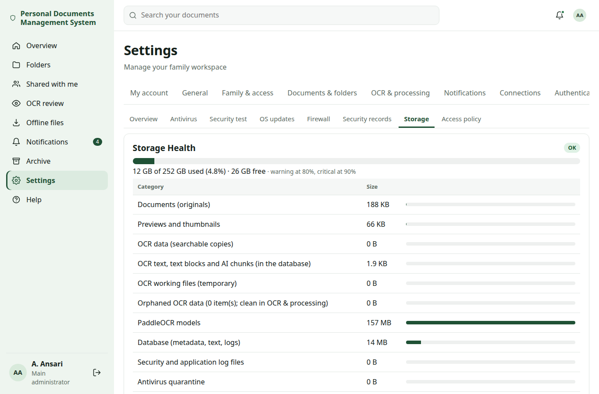 *Storage Health and safe cleanup* |
| 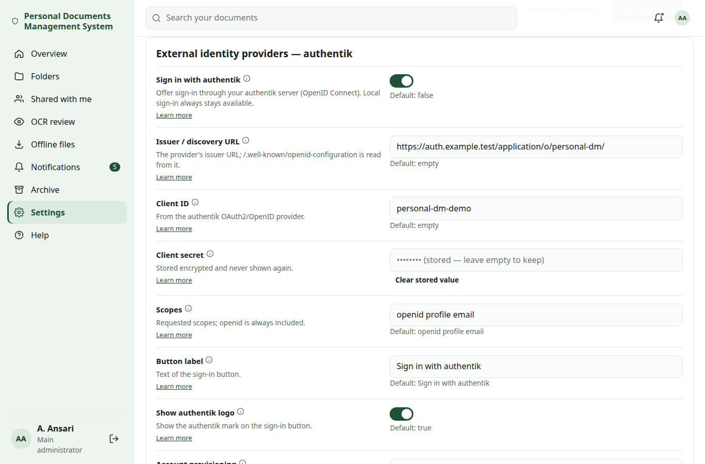 *Sign in with authentik (OpenID Connect)* |  *Password, authenticator app and passkeys* |
|  *Country/IP access policy and GeoIP* | |
|  *Login audit* |  *Daily / weekly / monthly backups* |
|  *Local AI profiles (optional)* | |

### Phone (installable app)

| | | | |
|---|---|---|---|
| 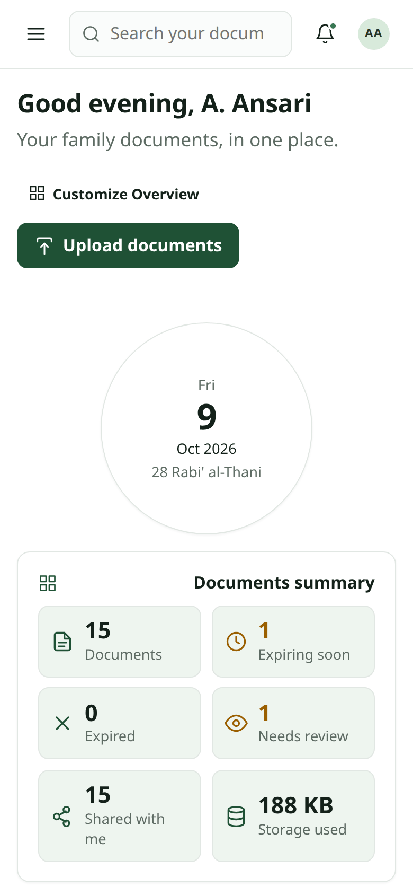 *Overview* |  *Folders and Move to…* |  *Viewer toolbar* | 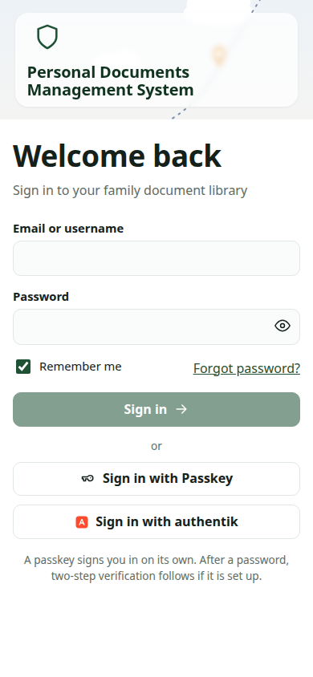 *Sign-in comes first* |

## Architecture

```
Internet → Nginx Proxy Manager / Pangolin (HTTPS) → country/IP access policy → rate limits
        → Personal Documents Management System (Django + React PWA) → per-document permissions → audit log
                     │
                     ├─ PostgreSQL (metadata, search, settings, audit)
                     ├─ worker: OCR, previews, imports, AI jobs (bounded concurrency)
                     ├─ scheduler: reminders, notifications, backups, GeoIP, traffic reports
                     └─ storage: originals + derivatives on the LXC disk; backups on a mounted NAS
```

It is a Django 5.2 modular monolith with a React/TypeScript single-page app, run by systemd units (`personaldocs-web`,
`-worker`, `-scheduler`). Details are in [docs/ARCHITECTURE.md](docs/ARCHITECTURE.md) and the
[decision records](docs/adr/).

## Requirements

- Proxmox VE with a **Debian 13** LXC: 2 vCPU, 4 GB RAM and 50 GB disk to start. The container needs nesting for
  service isolation; NFS/SMB mounting from the app needs a privileged container.
- A domain and HTTPS through **Nginx Proxy Manager** or **Pangolin**.
- Optional: a NAS share for backups, an SMTP account, a Telegram bot, a MaxMind GeoLite2 licence (free), and a LAN
  PC running LM Studio or Ollama for Local AI.

## Install

**Platform:** Debian 13 (trixie), x86_64 or aarch64, with systemd: a VM, a bare-metal server or a Proxmox LXC.
Plan on 2 vCPU, 4 GB RAM and 50 GB disk to start. The container needs nesting for service isolation, and NFS/SMB
mounting from the app needs a privileged container. On a Proxmox host, `scripts/proxmox-create-lxc.sh` can create
the container.

**Privileges:** run the installer as `root`. The app itself runs as the unprivileged `personaldocs` user; only a
small, audited helper for NAS mounting runs as root.

```bash
bash -c "$(curl -fsSL https://raw.githubusercontent.com/atikansari-ghr/Personal-DM/main/personal-DM.sh)"
```

**What it does:** it checks the system (Debian 13, root, systemd, CPU, memory, disk, network). It then downloads the
source to `/root/personaldocs-src` and starts the guided installer, which:
- asks for the domain, the reverse proxy address, the NAS and the backup time
- installs PostgreSQL, Tesseract (with orientation detection), OCRmyPDF, LibreOffice, GoAccess, a Python virtualenv
  and the built web app
- creates the systemd services, connects the NAS and runs a first backup and health check

It is safe to run again: answers are remembered (never secrets) and finished steps are skipped.

**Where things go:**

| Path | Contents |
|---|---|
| `/opt/personaldocs` | application releases (`current` → active release; previous releases kept for rollback) |
| `/var/lib/personaldocs` | documents, derivatives and pre-upgrade database snapshots (your data) |
| `/etc/personaldocs` | configuration and keys (`personaldocs.env`, readable by the service only) |
| `/var/log/personaldocs` | logs: `personal-DM.log` (one-line installer), `install.log`, `easy-install.log` |
| `/usr/local/bin/personaldocs` | the maintenance command used below |

**Menu or commands** (add after `--` for unattended use): `install`, `upgrade`, `repair`, `doctor`, `status`,
`backup`, `restore DIR`, `recover-admin USER`, `help`. Options: `--ref TAG`, `--dry-run`, `--yes`. The script
refuses anything other than Debian 13, never deletes data, and stops with the log location if a step fails.

Prefer to read before running? Clone the repository and start `bash personal-DM.sh` (or
`bash scripts/easy-install.sh`) from the checkout. For a private fork, see
[private GitHub access](docs/guides/private-github.md). Full details are in the
[installation guide](docs/guides/installation.md).

## Reverse proxy and first-run setup

1. Point the proxy host at `http://<container-ip>:8000` and set `PD_TRUSTED_PROXY_IPS` to the proxy's address so
   real client IPs are logged ([reverse proxy](docs/guides/reverse-proxy.md),
   [real client IP](docs/guides/security-access.md#real-ip)).
2. Open the HTTPS address and enter the one-time setup code printed by the installer (`personaldocs setup-token`
   prints a new one).
3. The wizard creates **your Main Administrator account only**. Adding family members is an optional step you can
   skip; add them any time in **Settings → Family & access**. Members sign in with a temporary password and choose
   their own; passkeys and an authenticator app can be added under **My account**
   ([setup guide](docs/guides/setup.md)).

Use `sudo personaldocs check-access` when the site cannot be reached.

## Upgrade, backup and restore

```bash
bash -c "$(curl -fsSL https://raw.githubusercontent.com/atikansari-ghr/Personal-DM/main/personal-DM.sh)" -- upgrade
# or, on the server:
sudo personaldocs upgrade          # verified backup → fetch → build → migrate → restart → health check
sudo personaldocs post-upgrade     # once after upgrading from an older release: ClamAV, host helper (the one-liner does it)
sudo personaldocs repair           # safe; never resets data or keys; installs missing OCR language packs
sudo personaldocs doctor           # proxy, GeoIP, passkey origin, AI, ClamAV, storage and service checks
sudo personaldocs status | backup | restore DIR | rollback | recover-admin USER [--reset-2fa]
sudo personaldocs access-policy status | off | rollback   # country/IP policy recovery from the console
```

- Backups go to a mounted NAS on a daily, weekly or monthly schedule and are verified after writing.
- Restores are done from the server console, so a web session can never overwrite the library.
- Upgrades install ClamAV (about 1.2 GB of memory; `--without-antivirus` skips it) and the root host helper used by
  Settings → Security. Files stored before this release show *Not scanned* until you run **Scan entire existing
  library**.
- Upgrading never deletes existing accounts. Installations upgraded from earlier releases keep automatic OCR for
  every document type until the administrator changes the OCR policy; new installations start with Manual OCR.

See the [upgrade guide](docs/guides/upgrades.md) and [backup & restore](docs/guides/backup-restore.md).

## Development and testing

Requirements: Python 3.13, Node 22, PostgreSQL 15+, and optionally `tesseract-ocr ocrmypdf libreoffice-writer poppler-utils`.

```bash
python3.13 -m venv .venv && .venv/bin/pip install -r backend/requirements-dev.txt
(cd frontend && npm ci && npm run build)
sudo -u postgres psql -c "CREATE ROLE personaldocs LOGIN CREATEDB PASSWORD 'devpass'" -c "CREATE DATABASE personaldocs OWNER personaldocs"
export PD_DEBUG=1 PD_DB_PASSWORD=devpass PD_DATA_DIR=/tmp/pd-dev/data PD_CONFIG_DIR=/tmp/pd-dev/config
scripts/dev-server.sh                                       # web on :8000 + worker
(cd backend && ../.venv/bin/python manage.py setup_token)   # then open http://localhost:8000
```

Before every push:

```bash
scripts/verify.sh          # compile, Django checks, migrations, settings reference, shellcheck, pytest,
                           # frontend type check and build, privacy/authorship/link check
scripts/e2e.sh             # browser flow, accessibility audit (3 themes) and desktop/tablet/phone parity checks
```

All test data is synthetic. See [testing](docs/guides/testing.md) and [CONTRIBUTING.md](CONTRIBUTING.md).

## Documentation

| Document | For |
|---|---|
| [User guide](docs/USER_GUIDE.md) | Everyone in the family |
| [Administrator guide](docs/ADMIN_GUIDE.md) | Whoever runs the server |
| [Guides](docs/guides/) | Topic guides, also bundled in the app under Help: [Overview](docs/guides/overview.md), [sign-in designs](docs/guides/login-designs.md), [selective OCR](docs/guides/ocr-corrections.md), [setup](docs/guides/setup.md), [antivirus](docs/guides/antivirus.md), [authentik](docs/guides/authentik.md), [security center](docs/guides/security-center.md) and more |
| [Settings reference](docs/SETTINGS_REFERENCE.md) | Every setting (generated) |
| [Requirements](docs/REQUIREMENTS.md), [traceability](docs/TRACEABILITY.md) | Requirement → code → test → document |
| [Architecture](docs/ARCHITECTURE.md), [decisions](docs/adr/) | Maintainers |
| [Implementation status](docs/IMPLEMENTATION_STATUS.md), [test report](docs/TEST_REPORT.md) | What is done and verified |
| [OCR benchmark](docs/OCR_BENCHMARK.md) | How the OCR pipeline was measured |
| [Release checklist](docs/RELEASE_CHECKLIST.md), [changelog](CHANGELOG.md) | Releasing |

## Security and privacy

- **Private by design:** documents, OCR, previews, search and AI stay on your server. No telemetry or analytics
  leave it, and the web app loads no third-party scripts, fonts or CDNs. The optional weather widget (off by
  default) sends only a city's coordinates from the server to the weather provider.
- **Default-deny permissions** on every server route, an audit log for every view, download, share, move,
  archive and delete, and a "why can this person see it" explanation.
- **Strong sign-in:** passwords, TOTP, passkeys (WebAuthn), recovery codes, a country/IP access policy, rate limits
  and security alerts.
- **Backups** to your NAS, verified after writing; restores only from the server console.
- **Antivirus and security checks** run locally (ClamAV, a manual baseline test). They reduce risk but do not prove
  the system is free of vulnerabilities; the security test is not a penetration test.

Please do not open public issues for vulnerabilities. See [SECURITY.md](SECURITY.md) for how to report them
privately, and for what the project does and does not protect against.

## OCR and AI

OCR uses Tesseract locally and is **selective**: the administrator decides per document type whether it is
disabled, manual (the default) or automatic for the primary source only, and people choose the files, pages and
languages (English, Arabic, Hindi and more) to recognise. OCR data can be removed again; the original file is never
changed. See [OCR guide](docs/guides/ocr-corrections.md). Images are first turned upright (phone EXIF orientation and Tesseract's orientation
model), straightened, contrast-stretched, enlarged and denoised. Every step was kept only if it measurably helped
([OCR benchmark](docs/OCR_BENCHMARK.md)). Suggested details are always reviewable suggestions.

The optional **Local AI** uses your own LM Studio or Ollama server on the LAN. It is off by default, filtered by
permissions and by each document type's *AI may read text* policy, produces suggestions only, and never falls back to the cloud. See [Local AI](docs/guides/local-ai.md).

## Mobile and PWA

The same app works on phones and tablets and can be installed to the home screen. It supports camera upload, a
touch-friendly **Move to…**, offline copies per account, and account settings (theme, Overview layout, folder view) that
follow you to every device. See [mobile & PWA](docs/guides/mobile-pwa.md).

## Roadmap

- WhatsApp notifications (in addition to e-mail and Telegram).
- A tested Proxmox appliance image.
- Public release once the hardware checks in the [test report](docs/TEST_REPORT.md) are complete.

Ideas and bug reports are welcome as GitHub issues (never attach real documents).

## Support

If this project is useful to you, you can support its development:

[☕ Support this project on Ko-fi](https://ko-fi.com/atikansari)

## Contributing

Contributions are welcome. See [CONTRIBUTING.md](CONTRIBUTING.md). The most important rule: **only synthetic
data**. Never commit real documents, names, OCR text, databases, backups, keys, tokens or screenshots of a real
installation.

## License

[MIT](LICENSE) © Atik Ansari. Third-party components keep their own licences (for example Django, React and
PDF.js; see their package metadata).

## Author

**Atik Ansari** — author and maintainer · [github.com/atikansari-ghr](https://github.com/atikansari-ghr)
