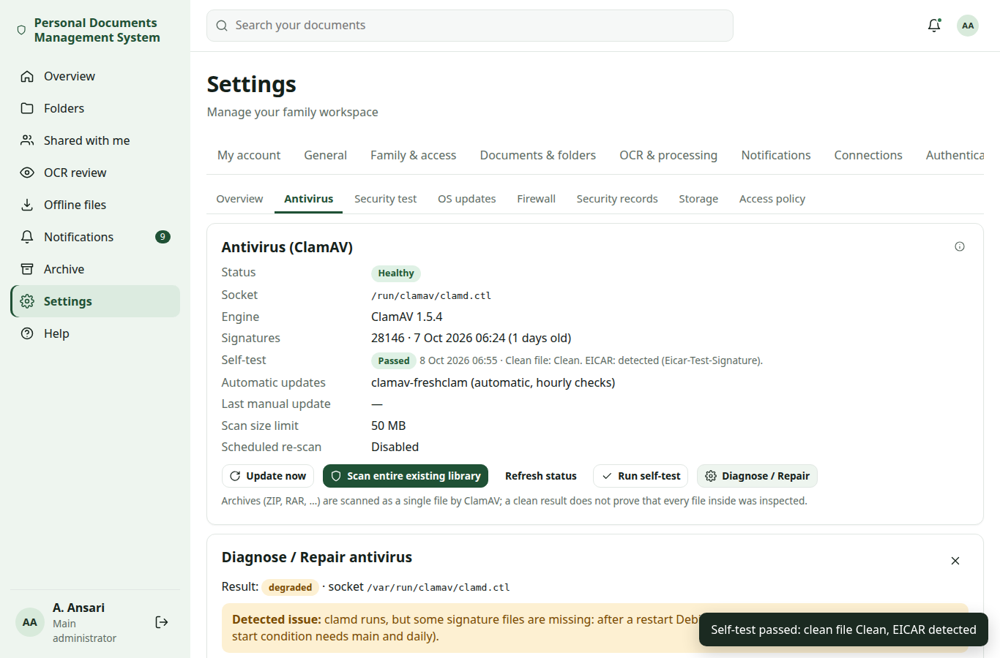

# Antivirus (ClamAV)

## How scanning works {#overview}

Every new file is scanned in the background by **ClamAV**, the free open-source antivirus engine, running on your own server. Uploads are never held up: a file is stored and usable at once, and its scan status updates a few seconds later. Nothing is ever sent to a cloud scanner. Only file names, sizes, detection names and versions are logged — never file contents or recognised text.

| Status | Meaning |
| --- | --- |
| **Scan pending** | Stored and usable; waiting for its background scan. |
| **Clean** | ClamAV found nothing with the signatures of that moment. |
| **Not scanned** (warning) | ClamAV was unavailable or scanning is turned off. The file stays available. |
| **Not scanned — size limit exceeded** | Larger than the scan limit. Stored normally, never reported as clean. |
| **Scan failed** | ClamAV answered with an error for this file. The file stays available. |
| **Threat detected** / **Quarantined** | Malware found. The file is moved to quarantine and blocked (see below). |
| **Released from quarantine** | The main administrator released it after review. |

A small shield next to a file shows its status in folder lists; the document's **Versions** tab shows the engine, signature version and scan time. Files stored before antivirus scanning existed are marked *Not scanned* until an administrator runs **Scan entire existing library**.

**Fail-open by design:** if ClamAV is down, uploads continue and files stay usable, but they are marked *Not scanned* (with a warning) and administrators receive a critical alert. Re-scan them once ClamAV runs again. Only administrators can re-scan, and only the main administrator can release a quarantined file. Files larger than the scan limit are marked *Not scanned — size limit exceeded*.

### Archives {#archives}

ZIP, RAR and similar archives are scanned **as one file** by ClamAV with its default archive limits. Personal DM does not unpack archives itself, so a *Clean* result on an archive does not prove that every file inside was inspected individually.

## Installation {#install}

`personaldocs install` and `upgrade` install `clamav`, `clamav-daemon` and `clamav-freshclam` and configure clamd to listen **only on the local Unix socket** `/run/clamav/clamd.ctl` (no TCP port). Since Change Set P the installer, `upgrade` (through `post-upgrade`), `post-upgrade` and `repair` no longer assume that installed packages mean antivirus works: they run the [antivirus repair](#repair) and finish with a real [self-test](#self-test). ClamAV needs about **1.2 GB of memory** for its signatures; on a 2 vCPU / 4 GB container this fits, on smaller machines install with `--without-antivirus` and turn scanning off in Settings → Security → Antivirus. `personaldocs status` and `doctor` show the daemon, the signature updater and the signature age.

## Status and health states {#status}

The **Status** badge on Settings → Security → Antivirus is based on what ClamAV does now, not on what it reported last time:

| Status | Meaning |
| --- | --- |
| **Healthy** | The daemon answers on its socket **and** a real scan of a small clean test buffer (sent through clamd's INSTREAM command) succeeds. |
| **Degraded** | The daemon answers and scans, but something non-fatal needs attention, usually out-of-date signatures. |
| **Unavailable** | The socket or the daemon cannot be reached (for example the socket file does not exist). New files are marked *Not scanned*. |
| **Error** | The daemon answers but cannot scan, or the last self-test failed. It stays in Error until a newer self-test passes. |
| **Turned off** | Scanning is switched off in the settings. |

The page also shows:

- **Socket**: the effective socket path the app uses.
- **Engine** and signature version: when ClamAV cannot be reached, these are the values from the last successful contact and are marked *(last seen …; not proof that scanning works)*. A version number on the page is never treated as proof that scanning works.
- **Self-test**: the time and result of the last self-test.

The hourly antivirus check also runs the self-test once a day and again after a failure. Alerts to administrators name the state and point to **Diagnose / Repair**. Unavailable and Error give the antivirus part of the [Security Health score](security-center.md#score) 0 points and put Security Health **At Risk** ("Antivirus is not scanning: …").

## Self-test {#self-test}

**Run self-test** (administrators) writes two small files into a private temporary directory (mode 0700): a harmless text file and the standard **EICAR test file** (a harmless text string that every antivirus reports as a test detection). It scans both through the same path as uploads and then deletes them. It passes when the text file is *Clean* and EICAR is detected.

The self-test never creates a document, a version or a quarantine entry, never uses real malware, and is recorded in the audit log as `antivirus.self_test`. The same test runs at the end of every repair and in `sudo personaldocs antivirus selftest`.

## Diagnose / Repair {#diagnose}



**Diagnose / Repair** opens a panel that lists every check with ✔ (fine), ! (warning) or ✘ (problem), a **Detected issue** line with the likely cause, and the fix for each failed check:

| Check | What it looks at |
| --- | --- |
| Packages | `clamav`, `clamav-daemon` and `clamav-freshclam` installed |
| Signatures | `main` and `daily` signature files present in `/var/lib/clamav` |
| clamav-daemon | active; or skipped by its start condition (no signatures); last result (for example `oom-kill`) |
| clamav-daemon.socket | the systemd socket unit is listening |
| clamav-freshclam | the signature updater is active |
| Restart policy | the Personal DM drop-in that restarts clamd after a crash is installed |
| Effective socket | the socket unit's path compared with `LocalSocket` in `/etc/clamav/clamd.conf`; a mismatch is reported |
| No network listener | no `TCPSocket` in clamd.conf |
| Runtime directory | `/run/clamav` exists |
| Socket file | exists, is a socket, owner, group and mode |
| Stale pid | a leftover `clamd.pid` from a crashed daemon |
| Service account access | the Personal DM service account (`personaldocs`) can connect and gets `PONG` |
| Version | engine and signature version |
| Scan self-test | clean text is Clean, EICAR is detected (INSTREAM) |
| Memory | clamd needs about 1.2 GB; a 4 GB container is recommended |
| Journal hints | out of memory, permission or AppArmor denied, configuration errors, missing database, stale socket |

**Repair antivirus** asks the root [host helper](security-center.md#updates) to run the fixed repair steps (action `antivirus_repair`; the browser cannot send commands). The panel then shows every step, the service restart, the socket check, the self-test and the final status. If the host helper is not installed, the panel shows the command to run on the server instead: `sudo personaldocs antivirus repair`.

### What the repair does {#repair}

The repair runs as root, is safe to repeat (it only changes what is wrong) and never opens a TCP port:

1. Installs missing packages.
2. Rewrites `/etc/clamav/clamd.conf` so `LocalSocket` equals the systemd socket unit's path (default `/run/clamav/clamd.ctl`); removes `TCPSocket` and `TCPAddr`; sets `LocalSocketMode 666`, `FixStaleSocket true`, `StreamMaxLength 1100M`, `ConcurrentDatabaseReload no`; **removes `EnableVersionCommand`** (Debian 13's clamd does not know it and refuses to start with it — earlier releases added it) and any other option `clamconf` reports as unknown. The original file is backed up once as `/etc/clamav/clamd.conf.personaldocs-backup`. The result is checked with `clamconf`.
3. Installs `/etc/systemd/system/clamav-daemon.service.d/50-personaldocs.conf` (`Restart=on-failure`, `RestartSec=15s`) and `/etc/tmpfiles.d/personaldocs-clamav.conf` (`d /run/clamav 0755 clamav clamav -`), then runs `systemctl daemon-reload`.
4. Downloads signatures with `freshclam` if they are missing.
5. Enables `clamav-freshclam`, `clamav-daemon.socket` and `clamav-daemon`; stops the daemon and clears a stale pid file; starts the socket and then the daemon.
6. Waits up to **4 minutes** for clamd to load its signatures and answer `PONG`, also as the `personaldocs` service account.
7. Runs the full diagnosis and the self-test again.

It reports success only when the final state is **Healthy** or **Degraded**. On the command line, `sudo personaldocs antivirus repair` also syncs the app's socket setting (`antivirus.socket`) to the effective socket and runs the app's own self-test.

### Persistence after a reboot {#persistence}

Two small files make the repair survive a reboot or an LXC restart, and they can stay in place:

- the **restart drop-in** (`50-personaldocs.conf`): Debian's `clamav-daemon.service` has no `Restart=`, so a clamd stopped by the out-of-memory killer would otherwise stay down;
- the **tmpfiles entry** (`personaldocs-clamav.conf`): recreates `/run/clamav` with the right owner at every boot.

These were verified as configuration in the automated tests. A real reboot of a Debian 13 LXC has not been tested yet, so reboot once after the repair and check that the status is still Healthy.

## Command line {#cli}

```bash
sudo personaldocs antivirus status     # full diagnosis as root (the checks above) with the likely cause
sudo personaldocs antivirus repair     # the repair above, then the app's own self-test
sudo personaldocs antivirus selftest   # clean file + EICAR through the app's scan path
sudo personaldocs doctor               # starts with the root ClamAV diagnosis, then the app checks
```

`doctor` lists, after the root diagnosis, the app checks *ClamAV socket used by the app*, *ClamAV scanner operational (reachable and scans)* and *ClamAV self-test (clean file + EICAR, temporary files removed)*. Inside the app the same tools are available as `sudo personaldocs manage antivirus status|selftest|sync-socket PATH`.

## Troubleshooting: "Unavailable … /run/clamav/clamd.ctl (FileNotFoundError)" {#socket-missing}

This message means the socket file the app connects to does not exist. Installations upgraded before Change Set P could show it although the page still listed an engine version and a signature date: those values were cached from the last successful contact and are not proof that scanning works.

On Debian 13 (packages `clamav-daemon` and `clamav-freshclam` 1.4.3), the usual causes are:

- **LocalSocket mismatch with socket activation.** `clamav-daemon.service` is started by `clamav-daemon.socket`, which listens on `/run/clamav/clamd.ctl` and removes the file when it stops (`RemoveOnStop=True`). Debian's default `/etc/clamav/clamd.conf` says `LocalSocket /var/run/clamav/clamd.ctl` — the same place on disk, but a different string. When the strings differ, clamd does not take over the systemd socket; it creates its own socket file and deletes it when it stops or restarts, so the path the app uses goes missing. The earlier installer only added `LocalSocket` when it was missing, so it kept Debian's line.
- **Skipped start condition.** Both units have a `ConditionPathExistsGlob` for the `main` and `daily` signature files. Without signatures they are skipped (shown as inactive, with no error), and nothing starts them later when freshclam has downloaded the signatures.
- **Out of memory without restart.** clamd needs about 1.2 GB. When the out-of-memory killer stops it, Debian's unit does not restart it.

The diagnosis names the cause on your host. Fix it with:

```bash
sudo personaldocs antivirus status      # shows the failed checks and "Likely cause"
sudo personaldocs antivirus repair      # fixes them and runs the self-test
```

To look by hand:

```bash
systemctl status clamav-daemon clamav-daemon.socket
journalctl -u clamav-daemon -n 50
ls -l /run/clamav/
grep LocalSocket /etc/clamav/clamd.conf
systemctl show -p Listen clamav-daemon.socket
```

After a successful repair, `LocalSocket` and the socket unit's `Listen` both show `/run/clamav/clamd.ctl`, the socket file exists, and Settings → Security → Antivirus shows **Healthy**; **Run self-test** passes. Then re-scan the files marked *Not scanned* with **Scan entire existing library**.

This fix was verified on a simulated Debian 13 host in the automated tests and against a real clamd (ClamAV 1.5.4) in a development container. It has **not yet been run on a real Debian 13 Proxmox LXC**, so run `sudo personaldocs antivirus repair` (or the upgrade) and check its result on your server.

If the repair reports too little memory, give the container at least 4 GB, or turn scanning off.

## Quarantine and release {#quarantine}

When ClamAV detects a threat, the file is immediately marked *Threat detected*, moved to `<data>/quarantine` (readable only by the service) and **preview, download, sharing, export, OCR and Local AI are blocked** for it. Its metadata stays so the record can be managed, and administrators receive a critical notification.

Only the **main administrator** can act on a quarantined file in Settings → Security → Antivirus:

- **Release…** shows a malware warning and requires a confirmation and a reason (at least 10 characters); the release is audited and administrators are notified.
- **Delete…** permanently deletes the quarantined copy after typing DELETE (the document too, if it was its only file).

Administrators see the quarantine but cannot release files. Quarantined copies are not included in backups.

## Scan size limit {#size}

**Maximum scan size** (default 50 MB) sets the largest file scanned. Larger files are stored and marked *Not scanned — size limit exceeded*. Values above 200 MB can use a lot of memory on a 4 GB server. clamd's own stream limit is set higher by the installer, so the setting in the app decides.

## Scanning the existing library {#schedule}

Administrators can start **Scan entire existing library** (or re-scan one document) under Settings → Security → Antivirus. It runs in the background in small batches with progress, and can be paused, resumed or cancelled. **Re-scan the whole library** can also run Daily, Weekly or Monthly (default: Disabled) at a chosen time; a monthly day that does not exist in a month runs on its last day.

## Signature updates {#signatures}

`clamav-freshclam` updates the signatures automatically (hourly checks). **Update now** runs an immediate update through the root host helper. The page shows the signature version, its date and age, the last manual update and any error. Signatures older than **Definitions out of date after** (default 2 days) show a warning; older than **critically stale** (default 7 days) they put Security Health *At Risk*. ClamAV unavailable, stale definitions, update failures, scan failures, detections and releases are **critical administrator notifications that cannot be turned off**.
