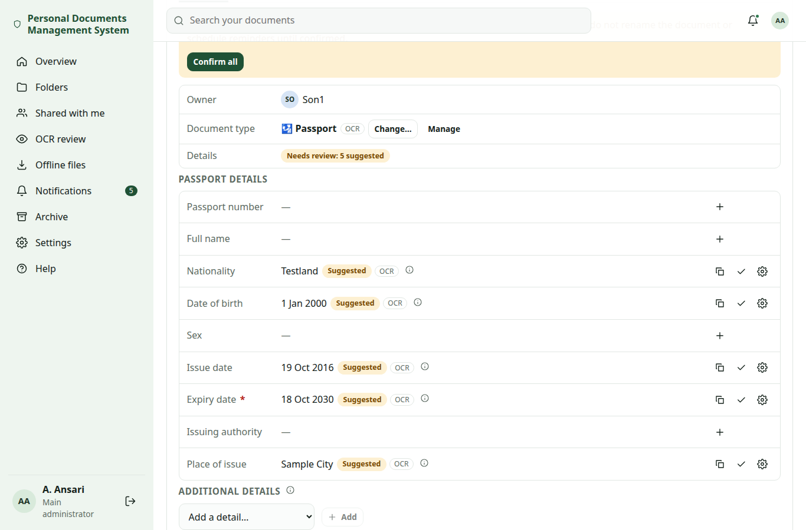
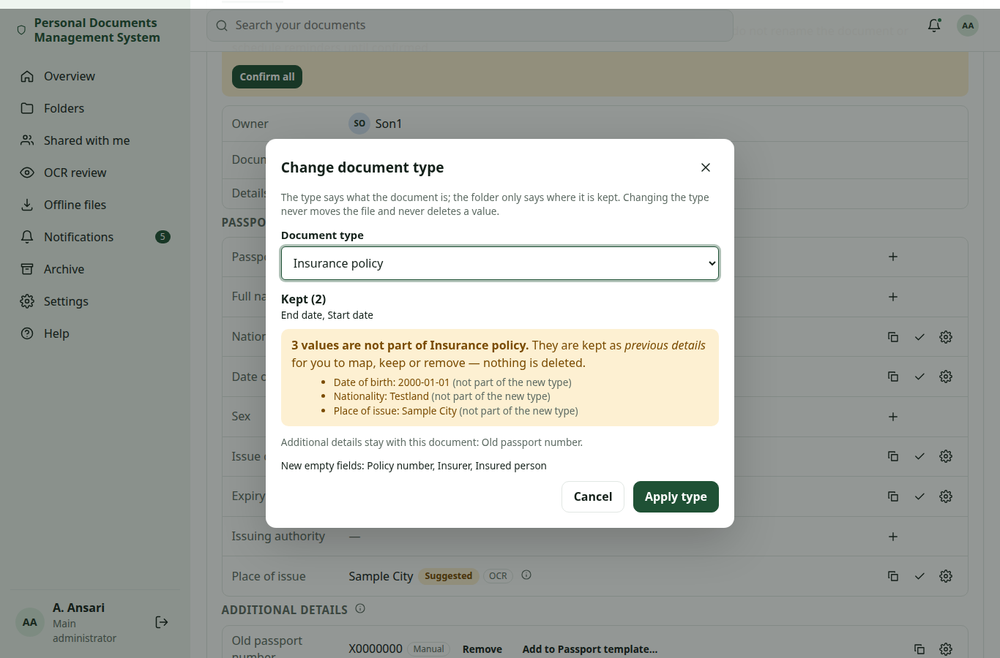
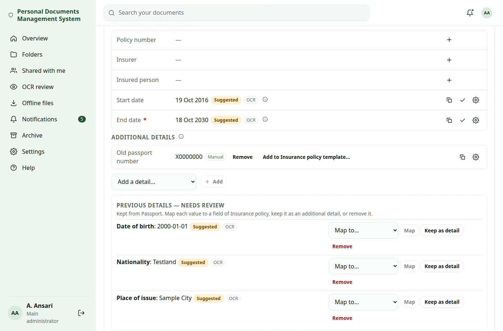
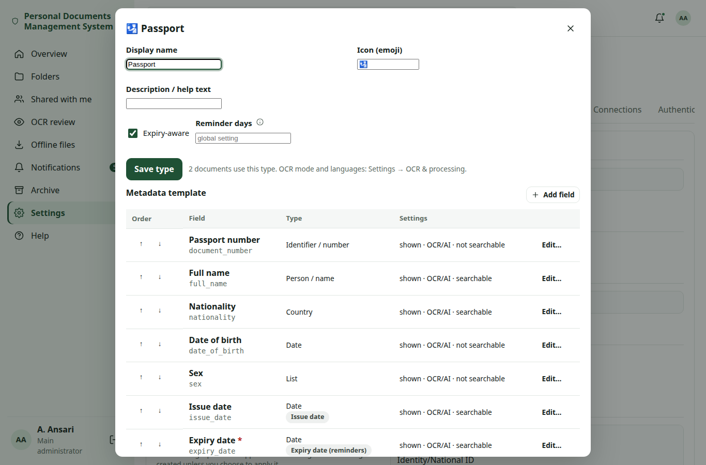
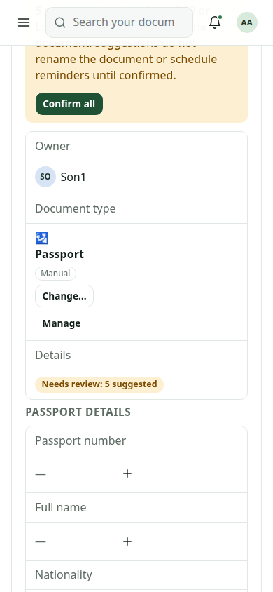

# Document types and details

Every document can have a **document type** (Passport, Visa, Insurance policy…). The type decides which details the
document shows, which details OCR and the local AI may suggest, which date counts as the expiry date and how many
days before expiry reminders are sent. Types and their fields are data the main administrator can change; nothing is
fixed in the code.

Examples use the demo labels A. Ansari (administrator), Mom, Son1, Son2, Son3 and Daughter and synthetic values only.

## Folder versus document type {#folder-vs-type}

A **folder** says *where* a document is kept and *who* can see it. A **document type** says *what* the document is.
The two are independent:

- Moving a document never changes its type.
- Changing the type never moves the file.
- A folder can contain documents of different types, and documents of one type can be in many folders.

Example (synthetic):

| Folder | Document | Type |
|---|---|---|
| Son1 / Identity / Passport / Old Cancelled Passport 2016 | Cancelled passport, Sample Person | Passport |
| Son1 / Travel / UK / 2027 | Visit visa, Testland | Visa |
| Son1 / Travel / UK / 2027 | Travel insurance | Insurance |

The old passport stays a *Passport* although it lives in a sub-folder about cancelled documents, and the visa folder
holds a visa and an insurance policy. A folder can **suggest** a type for new uploads (see
[folder suggestions](#folder-suggestions)), but it never decides it.

## The Details panel {#details-panel}

Open a document and look at **Details**:

- **Owner**.
- **Document type**: the type, or **Not assigned**. People who may edit the document see **Set type** (no type yet)
  or **Change…**. Viewers see the type read-only. The main administrator also sees **Manage**, which opens
  Settings → Documents & folders → Document types at this type.
- **Details status** (see [status](#status)).
- **Passport details** (the heading is named after the type): the fields of the type's template in their configured order. Empty fields show **+** to add a
  value.
- **Additional details**: one-off details of this document only (see [additional details](#custom-details)).
- **Previous details — needs review**: values kept after a type change (see [changing a type](#change-type)).

### Where you can set the type {#assign}

- **Upload dialog**: choose the type; when the folder has a suggested type it is preselected with the hint
  *Suggested by this folder*.
- **Details panel**: **Set type** / **Change…**.
- **Document ⋮ menu** in Folders and **More actions** on the document page: **Set document type…** /
  **Change document type…**.
- **Several documents at once**: tick them and choose **Set type…** (see [bulk](#bulk)).

## Values, suggestions and provenance {#provenance}

Each value shows where it came from:

| Badge or chip | Meaning |
|---|---|
| **Suggested** | Proposed by OCR, the passport machine-readable zone or the local AI; not yet confirmed. |
| **Edited** | A person replaced a value that came from OCR or AI. |
| Manual | Entered by a person. |
| OCR | Read from the recognised text. |
| OCR (MRZ) | Read from a passport's machine-readable zone (check digits validated). |
| Local AI | Proposed by your local AI server. |
| Imported | Came with an import. |
| System | Set by the application. |
| Migrated | Kept from before document types had templates. |

Hover over a value (or long-press on a phone) to see who confirmed it and when.

Confirm a suggestion with ✓, edit it, or use **Confirm all**. Rules:

- Only **confirmed** values rename the document or drive reminders.
- A confirmed value is **never overwritten** by a later OCR run, a re-map or the AI. If a new reading differs, it is
  shown next to the value as *New scan suggests …* and you decide.
- Values are checked against the field type (date, number, select…) and any format the administrator set; an
  invalid value is refused with a message.

## Details status {#status}

| Status | Meaning |
|---|---|
| **Details confirmed** | Every required field has a confirmed value and nothing is waiting. |
| **Incomplete: …** | Required fields are empty; the badge names them, for example *Incomplete: Expiry date*. |
| **Needs review** | Something waits for a decision: *n suggested* values, *n previous* details or a *type suggested*. |

Some documents really lack a required value (an old card without an expiry date). **Confirm as incomplete** records
that you accept the empty required fields; the status no longer nags, and the decision is kept in the history.

## How OCR and the local AI fill in details {#ocr-ai}

- After OCR, the app suggests values only for the fields of the document's type that are marked **OCR / Local AI
  may suggest**. Other recognised words stay searchable text.
- The local AI (when enabled and allowed for the type) also proposes only fields that are in the template and marked
  extractable.
- Every proposal arrives as **Suggested**; nothing counts until a person confirms it.
- For an untyped document, OCR can **suggest a type** from the recognised text: a passport machine-readable zone, or
  wording such as "passport", "visa", "residence permit", "driving licence", "insurance policy" or "certificate".
  The suggestion shows its reason and confidence.

See [selective OCR](ocr-corrections.md#selective) and [Local AI](local-ai.md).

## Type suggestions {#suggestions}

A suggestion is never applied on its own. It appears in the Details panel with **Accept…**, **Change…** and
**Ignore**:

- **Folder suggestion**: the nearest folder with a suggested type (see [folder suggestions](#folder-suggestions)).
- **OCR suggestion**: from the recognised text, with reason and confidence.
- **Local AI suggestion**: from the existing AI suggestions; accepting it uses the same safe type change (source
  *Local AI*).

When the folder and OCR suggest different types, both are shown as a **conflict**; the app does not choose.
A **confirmed type is never silently replaced**. If a later suggestion differs, it is recorded with the note
"The confirmed type was kept." **Ignore** is recorded in the history.

## Changing a type {#change-type}

**Change…** opens a preview before anything happens:

- **Values kept**: fields that exist in both types.
- **Values that become previous details**, each with the reason (the new type has no such field).
- **Additional details** that stay as they are.
- **New empty fields** of the new type.
- A **warning when the expiry field no longer applies**: reminders for this document stop until a value is mapped to
  the new type's expiry field.

Nothing is deleted. After the change, values without a place in the new type wait under **Previous details — needs
review**:

For each one choose:

- **Map to a template field**: moves the value into a field of the new type (for example *Expiry date* to *End date*).
- **Keep as detail**: keeps it as an additional detail of this document.
- **Remove**: deletes this value (recorded in the history).

The expiry date and reminders are worked out again after the change; see [reminders](#reminders).

### Re-mapping existing OCR data {#remap}

When the document already has recognised text, **Re-map existing OCR data** proposes values for the new type's
fields from that text, without a new OCR scan. The proposals are *Suggested*; confirmed values are never replaced
(a different reading is shown as *New scan suggests …*).

## Additional details and template fields {#custom-details}

- **Template fields** belong to the type: every document of that type shows them, in the same order.
- **Additional details** belong to one document. Use **Add a detail…** → **New detail for this document…** (a name
  and a value), or pick one of the administrator's global custom fields. Adding a one-off detail never changes the
  template.

### Promoting a detail to the template {#promote}

When a one-off detail turns out to be useful for every document of the type, the main administrator can choose
**Add to … template…** on it (for example *Add to Passport template…*). After a confirmation the field is added to the template; only this document's
value moves into the new field, and other documents of the type just show the new field empty.

## Bulk classification {#bulk}

Tick documents in a folder or in search results and choose **Set type…**. The preview shows how many documents will
change and their current types. Documents that already have **another confirmed type** are skipped unless you tick
**Also change documents with a confirmed type**. Documents you may not edit are skipped. Each document goes through
the same safe change: values are kept or become previous details, never lost.

## Folder suggested types {#folder-suggestions}

On a folder's **⋮ → Suggested document type…** anyone who may organise the folder can choose a type that new uploads into this folder (and
its sub-folders, unless they set their own) should start with. Example: *Son1 / Travel / UK / 2027* suggests
*Visa*.

- The upload dialog preselects it with *Suggested by this folder*; you can choose another type.
- Files dropped without the dialog get a **pending suggestion only**; their type stays *Not assigned* until someone
  accepts it.
- Changing a folder's suggestion never changes documents already in it.

## Managing document types (main administrator) {#manage}

**Settings → Documents & folders → Document types** lists every type with the number of documents using it.

- **Add type**: start from the standard fields of a template (passport, visa, residence permit / iqama, national ID,
  driving licence, employee ID, insurance, certificate, generic) or copy another type's template.
- **Edit**: display name, icon or emoji, description, *expiry-aware*, and **reminder days** for this type.
- **Archive / Restore**: archived types are not offered for new documents; documents keep their type.
- **Delete** works only for a type no document uses. Otherwise move its documents to another type first (with the
  same value-preserving rules) or archive it.
- **OCR by document type** in Settings → OCR & processing still sets OCR mode, languages and Local AI per type, and
  stays in sync with the template's *OCR / Local AI may suggest* flags.

The seeded **Passport** template has: Passport number, Full name, Nationality, Date of birth, Sex, Issue date,
Expiry date (required, expiry role), Issuing authority and Place of issue. **Insurance** has Policy number, Insurer,
Insured person, Start date and End date.

### Configuring fields {#fields}

**Add field** (or edit an existing one):

| Setting | What it does |
|---|---|
| Label | Shown in the Details panel. |
| Key (optional) | Stable internal name; generated from the label when empty and kept when the label changes. |
| Field type | Text, Long text, Date, Number, Yes/No, Select (with choices), Country, Person, Identifier. |
| Role | **Expiry** (drives the expiry date and reminders), **Issue** (issue date) or **No expiry** ("Does not expire"). |
| Choices | For *Select*. |
| Help text | Shown under the field. |
| Shown | Turn a field off instead of deleting it; values stay stored. |
| Required | Empty required fields make the status *Incomplete*. |
| OCR / Local AI may suggest | Whether OCR and the AI may propose this field. |
| Searchable | Whether the value is found by search. Identifiers such as document numbers are not searchable by default. |
| Format | A regular expression the value must match, and a maximum length; numbers can have a minimum and maximum. |

Reorder fields with the **↑ / ↓** buttons (they work with the keyboard). The **preview** shows how the Details panel
will look. A field that already has values cannot be deleted; turn it off instead.

### Review untyped documents {#review-untyped}

**Review untyped documents** lists documents without a type together with their folder and OCR suggestions. Choose
a type per document and apply. Nothing is applied until you confirm, and documents whose suggestions conflict start
unselected. A small report shows typed, untyped, with suggestions and previous values waiting.

On the server, `sudo personaldocs manage document_types report` prints the same counts, and
`sudo personaldocs doctor` shows them in an info line.

## Expiry reminders and document types {#reminders}

- Only the **confirmed** value of the field with the **expiry role** sets the document's expiry date and drives
  reminders. Unconfirmed OCR or AI suggestions never do.
- A type's **reminder days** (for example 180, 90, 30 for a passport) replace the global schedule for its documents;
  an empty list uses the global setting.
- Changing the type works the expiry date out again: if the new type has no expiry field with a confirmed value,
  reminders stop until you map one. A type change never invents a date.

See [expiry reminders](expiry-rules.md#types).

## Search {#search}

The **type** filter in search and in the **OCR review** queue (All / Not assigned / a type) narrows results. Values
of fields marked *Searchable* are indexed. See [search](search.md).

## Permissions {#permissions}

| Who | May |
|---|---|
| Viewers | See the type and details read-only. |
| Editors (edit permission on the document) | Set or change the type, accept or ignore suggestions, edit values, add additional details, bulk-set types on documents they may edit. |
| People who may organise a folder | Set the folder's suggested type. |
| Main administrator | Everything above, plus manage types and templates, promote details to a template, and review untyped documents. |

Every type change, bulk change, re-map, review and settings change is written to the audit log, and the document
history records type changes, mapped/kept/removed previous values, re-maps, ignored suggestions and *Confirm as
incomplete*. Recognised text is never written to logs.

## On a phone {#mobile}

The Details panel, type selection and previous details work by touch on phones and tablets.

## Upgrading {#upgrade}

Existing typed documents keep their type (marked confirmed, source *Migrated*); untyped documents stay untyped and
are not guessed. Values outside the new templates become additional details; nothing is deleted. See
[upgrades](upgrades.md#change-set-n).
