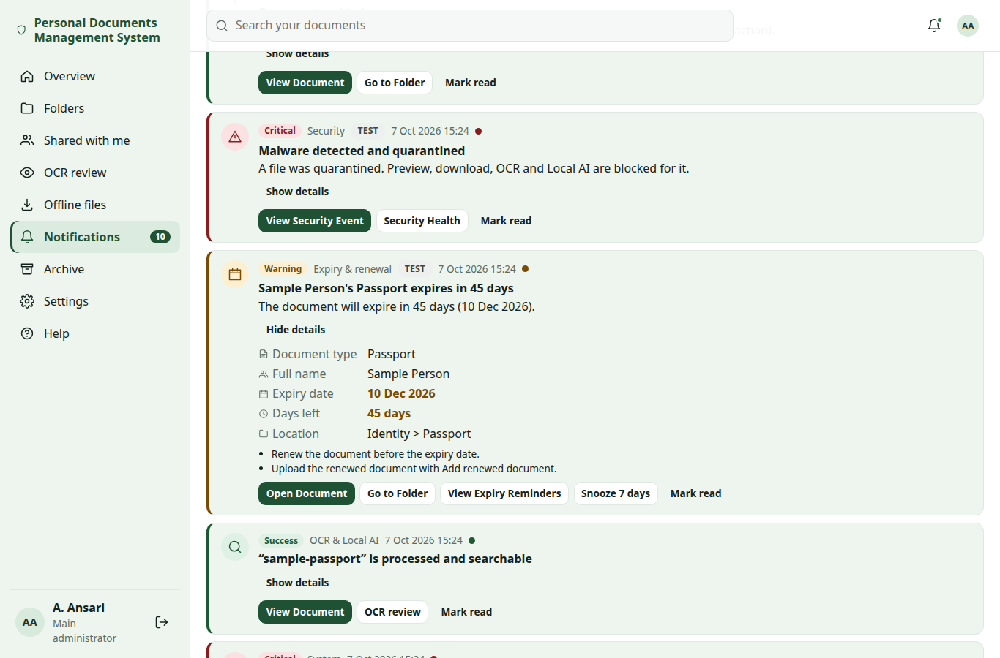
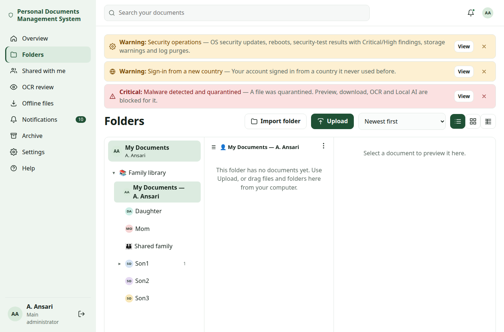
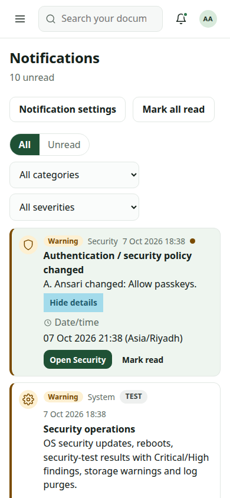
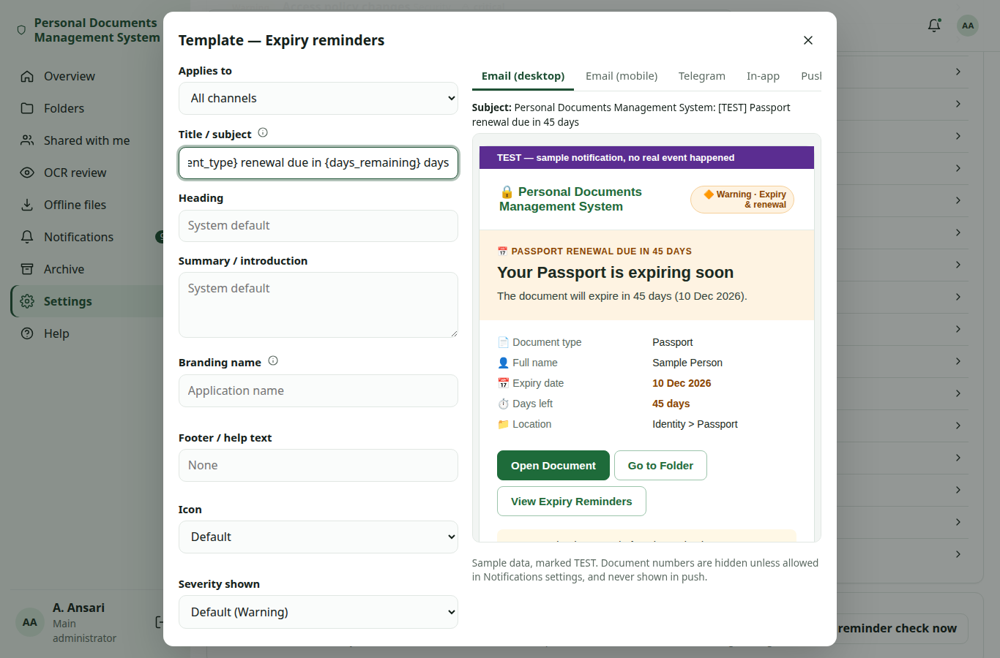
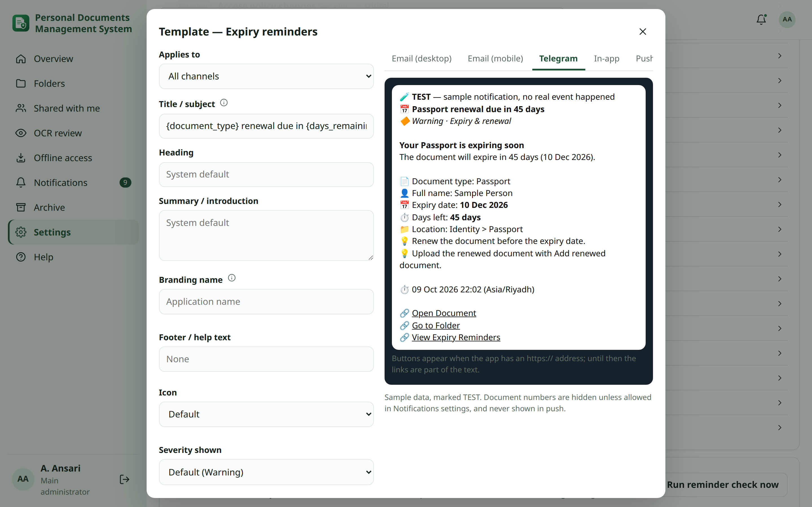

# Notifications

Every notification is built once from a structured message (event, severity, category, icon, title, summary,
details, actions and guidance) and then rendered for each channel: the in-app **Notification Center**, email (HTML
with a plain-text part), Telegram and push notifications on your phone or computer. The wording is the same
everywhere; each channel only gets the layout it can show.

Examples use the demo labels A. Ansari (administrator), Mom, Son1, Son2, Son3 and Daughter and synthetic values only
("Sample Person", "Testland", "Sample City", addresses from 203.0.113.0/24).

Which notifications reach you, and which ones you cannot turn off, is explained in
[critical and optional notifications](expiry-rules.md#critical). When and to whom expiry reminders are sent is in
[expiry reminders](expiry-rules.md#schedule).

## Severity and categories {#severity}

Each notification has one **severity** and one **category**. Both are always written as text next to the icon and
colour, so they never depend on colour alone.

| Severity | Meaning | Examples |
|---|---|---|
| **Critical** | Needs attention now | Malware detected, backup failed, sign-in from a new country, a document expires within 7 days or today, security test with Critical or High findings, OS security updates failed |
| **Warning** | Should be looked at soon | Document expires within 60 days, storage nearly full, reboot required, repeated failed sign-ins |
| **Success** | Something finished well | Import finished, OS security updates installed |
| **Information** | For your records | Document expires in more than 60 days, documents added, access given to you |

| Category | Covers |
|---|---|
| Documents | Documents added, archived, deleted, moved, restored, re-typed or confirmed by someone else |
| Expiry & renewal | Expiry reminders |
| OCR & Local AI | Text recognition and Local AI processing finished or failed |
| Security | Sign-ins, passwords and password resets, locked accounts, passkeys, authenticator app, recovery codes, authentik and Google links, antivirus, access policy, security test |
| System | Backups, integrity, storage, OS updates, reboot, imports |
| Sharing & access | Access given to you, shares |

The administrator may change the severity *shown* for an event in the [Template Manager](#templates), but a
critical event can never be shown below **Warning**.

## Icons {#icons}

One central icon list is used by every channel. In the web app each icon is drawn as an SVG with an accessible
label; email and Telegram use the emoji.

| Icon | Meaning | Icon | Meaning |
|---|---|---|---|
| 🚨 | Critical alert | 🔍 | OCR |
| 🛡️ | Security | 🧠 | Local AI |
| 👤 | Account | 💿 | Backup |
| 🌍 | Location (country) | 🌐 | Internet / HTTPS |
| 🔑 | Sign-in method, document number | 🔶 | Warning |
| 💻 | Device | 🚦 | Security Health |
| ⏱️ | Time | ℹ️ | Information |
| 📅 | Date | ⚙️ | System |
| 📄 | Document | 🗄️ | Storage |
| 📁 | Folder | 🔔 | Reminder |
| ⬆️ | Upload | ✅ / ❌ | Success / failure |

## Channels {#channels}

| Channel | What you see | Needs |
|---|---|---|
| **In-app** | A card in the [Notification Center](#center) and, for new warning, critical and success notifications, a [banner](#banners) | Always on |
| **Email** | A responsive HTML message plus a plain-text part (see below) | SMTP configured by the administrator and an email address on your profile |
| **Telegram** | A formatted message with an emoji per detail and buttons | Telegram configured by the administrator and linked by you |
| **Push** | A short notification on the lock screen or desktop of a device you turned on | The HTTPS address, push allowed by the administrator, and turned on per device (see [push](#push)) |

WhatsApp is planned for a later release and is not available.

**Email.** Each email has two parts. The HTML part has a header with the application name, the severity and
category as text badges, the headline, a short summary, a table of details with icons, buttons for the actions,
guidance ("What to do") and a footer. It uses a simple table layout with inline styles, no JavaScript, no images and
no tracking pixels, and `dir="auto"` so Arabic or Hindi names display correctly. The plain-text part keeps the earlier
layout, so mail programs that do not show HTML still show everything:

```
Notification from Personal Documents Management System
Account: son1 (Son1)

📅 Passport Expiry Alert
The passport of Sample Person expires in 30 days.

Document type: Passport
Name: Sample Person
Expiry date: 06 Nov 2026
Days remaining: 30
Folder: Family library / Son1 / Identity

Open Document: https://docs.example.com/documents/…
```

**Telegram.** Messages use Telegram's HTML formatting with an emoji per detail. When the installation has an
`https://` address, the actions appear as buttons below the message; otherwise (for example on an `http://` test
address, which Telegram does not accept for buttons) the links are written into the text. If Telegram rejects the
formatted message, it is sent again as plain text, so nothing is lost.

**Push.** A push notification shows only a title and a short summary, chosen by your
[lock-screen detail](#lock-screen) setting. Tapping it opens the matching page of the app.

## Notification Center and banners {#center}

Open **Notifications** (the bell, or `/notifications`). Each notification is a card with:

- the icon, the severity and the category as text, the title, a short summary, the time and an unread dot,
- the [actions](#actions) for that event as buttons,
- **Show details**: the details (with icons), the files involved and the guidance,
- **Mark read** / **Mark unread**.

At the top: **Mark all read**, the filters **All** / **Unread**, **Category** and **Severity**, and a link to
**Notification settings**. Older notifications appear with **Load more**. You only ever see your own notifications.
TEST messages sent by the administrator are marked **TEST**.



### Banners {#banners}

When a new **warning**, **critical** or **success** notification arrives, a compact banner in its severity colour
appears at the top of the app (at most three at a time), with **View** or **Open** and a dismiss button. Banners do
not appear while the Notification Center is open. Dismissing a banner does not delete anything: critical
notifications always stay in the Notification Center. The app checks for new notifications every 60 seconds and
whenever you move to another page.



On a phone, the Notification Center works by touch: filters, actions and **Show details** fit the screen in portrait
and landscape.



## Actions in notifications {#actions}

Notifications carry buttons that open the right place in the app:

| Event | Actions |
|---|---|
| Expiry reminder | **Open Document**, **Go to Folder**, **View Expiry Reminders**, **Snooze 7 days** (in-app only) |
| Documents added or changed | **View Document**, **Go to Folder** |
| Sign-in and account security (new address or country, passkeys, authenticator app, recovery codes, authentik, Google, passwords, account locked) | **Review Activity**, **Manage Sessions**, **Change Password** |
| Password reset email | **Reset password** (the single-use link; email only, see [security templates](#security-templates)) |
| Repeated failed sign-ins | **Review Activity**, **Access policy** |
| Antivirus (threat, scanner unavailable, signatures) | **View Security Event**, **Security Health** |
| OS updates, reboot | **View System Status**, **View Update Details** |
| Storage warning or critical | **Open Storage Health**, **Run Cleanup Analysis** |
| Backup failed, integrity problems | **Open Storage & backup** |
| Import finished | **View Import Report** |

Rules:

- Every action is a page of this application. Links never contain a token or a password (the one exception is the
  password reset email, whose single-use link is sent directly by email and never stored; see
  [security templates](#security-templates)); opening one still requires
  signing in and the normal permission checks, so a forwarded email gives nobody access.
- **Releasing a file from quarantine is never offered in a message.** Release stays inside the app, in Settings →
  Security → Antivirus, for the main administrator only (see [quarantine](antivirus.md#quarantine)). Actions that
  would point at the API or at a release are refused, also in custom templates.
- **Snooze 7 days** pauses expiry reminders for that document for you only, for seven days, and marks the card as
  read. Other recipients still get their reminders. It works only while you can still open the document, and it is
  recorded in the audit log.

## Critical and optional notifications {#critical}

Critical events always arrive in-app and on the administrator's critical channels, and you cannot turn them off;
everything else is your choice per event and channel under **My account → Notifications**. The full rules and the
default list are in [critical and optional notifications](expiry-rules.md#critical).

New events in this release:

| Event | Default |
|---|---|
| authentik account linked or unlinked | Critical (sent to the person whose account it is) |
| Someone else moved, restored, re-typed or confirmed the details of your documents | Optional, in-app |

**Push** is a fourth channel next to in-app, email and Telegram. It is never switched on for anyone automatically:
you turn it on per device, then tick it for the events you want.

New security events in Change Set P (all **critical by default**, category Security, sent to the person whose account
it is):

| Event | Name shown | When |
|---|---|---|
| `security.password_reset_requested` | Password reset requested | A reset link was sent by email (Forgot password? or an administrator) |
| `security.password_admin_reset` | Administrator reset your password | An administrator started a reset; other main administrators are also told about temporary passwords |
| `security.temporary_password` | Temporary password issued | An administrator issued a temporary password (the message never contains it) |
| `security.password_changed` | Password reset completed | The password was changed, reset with a link, or a temporary password was replaced |
| `security.account_locked` | Account locked | The per-account failed sign-in limit was reached; sent to the person and the administrators once per lock window, never with the attempted password |
| `security.google` | Google account linked or removed | A Google sign-in was linked or removed |

Renamed: `account.login` is now **New sign-in**, `security.new_country` **Unusual sign-in (new country)** and
`security.authentik` **authentik account linked or removed**. The passkey added/removed and authenticator app on/off
events are unchanged.

## Push notifications on your devices {#push}

Push notifications use the standard Web Push service of your browser (Apple, Google, Mozilla or Microsoft). The app
sends them only to these known push services, over HTTPS, and the content is encrypted for your device.

Requirements:

- the installation is opened through its **HTTPS address** (not `http://<ip>:8000`);
- the administrator has not turned off **Push notifications (PWA)** (`notifications.push_enabled`, on by default);
- on **iPhone and iPad** the app must first be added to the Home Screen (Share → *Add to Home Screen*) and opened from
  there;
- the browser must allow notifications for the site.

To turn it on, open **My account → Notifications → Push notifications on this device** on the device itself:

1. **Turn on for this device** and allow notifications when the browser asks.
2. **Send test push** to check that it arrives.
3. Tick **Push** for the events you want in the table of optional notifications. Critical notifications use push only
   if the administrator lists it among the critical channels.

The same section lists your devices with **Remove**. A device whose subscription has expired at the push service is
removed automatically. Turn it on again on each new device or browser.

### Lock-screen detail {#lock-screen}

**Lock-screen detail** (`me.push_preview`) decides what your devices may show without unlocking:

| Setting | Shows |
|---|---|
| **Minimal** | Only "You have a new notification" |
| **Standard** (default) | The alert title and a short summary without names, e.g. "📅 Passport Expiry Alert" |
| **Detailed** | Also document names |

Document numbers and document text are never sent by push, whatever you choose. Tapping a notification opens the
page inside the app; it never opens another site.

## Template Manager (main administrator) {#templates}

**Settings → Notifications → Templates** changes the presentation of a notification, per event and per channel (or
for all channels at once). You can change:

- **Title / subject** and **Heading**,
- **Summary / introduction** (plain text with the placeholders below),
- **Branding name**: shown in the email header instead of the application name (up to 60 characters),
- **Footer / help text**: an extra line in the footer of email and Telegram and under the in-app card (up to 300
  characters), for example "Questions? Ask A. Ansari.",
- **Icon** (from the central, approved local icon list),
- **Severity shown** (critical events can never be shown below Warning),
- **Action labels** (plain text, no placeholders). For the password reset email, the button label is the
  `reset_password` action label.

Branding name and footer were added in Change Set P (migration `notify.0003_template_brand_footer`).

### Placeholders {#placeholders}

| Placeholder | Example value (synthetic) |
|---|---|
| `{app_name}` | Personal Documents Management System |
| `{recipient_name}` | Son1 |
| `{event_title}` | Passport Expiry Alert |
| `{document_name}` | Passport — Sample Person |
| `{document_type}` | Passport |
| `{owner_name}` | Sample Person |
| `{expiry_date}` | 06 Nov 2026 |
| `{days_remaining}` | 30 |
| `{folder_path}` | Family library / Son1 / Identity |
| `{event_time}` | 07 Oct 2026 08:00 |
| `{device}` | Chrome on Windows |
| `{location}` | Sample City, Testland |
| `{ip_address}` | 203.0.113.25 |
| `{security_status}` | Attention |
| `{count}` | 3 |

A placeholder that does not apply to an event stays empty.

### What cannot be changed {#template-limits}

- Templates are **plain text**. Code, HTML and Markdown are not interpreted: anything that looks like HTML is shown as
  text. Unknown placeholders and any other braces are refused when you save.
- The details, the action targets, the recipients and the channels of an event are not part of a template; they come
  from the event itself and from the [notification settings](expiry-rules.md#critical).
- Sensitive values (document numbers, codes, tokens) are not available as placeholders.
- A critical event cannot be shown below Warning.
- The [mandatory security text](#security-templates) of security events is shown as locked and cannot be removed or
  changed.
- An HTML email always keeps its plain-text part.

**Reset to default** removes the override for that event and channel. Every save and reset is recorded in the audit
log (`notifications.template_update`, `notifications.template_reset`).

### Security templates and mandatory text {#security-templates}

Every security event carries **mandatory security text**: one or more fixed warnings that are part of the message on
every channel. Examples:

- "If this was not you, change your password and sign out other devices in My account → Security, and tell the family
  administrator." (sign-ins, passkeys, authenticator app, recovery codes, passwordless)
- "The temporary password is never sent in this message. You must choose a new password when you next sign in."
  (Temporary password issued)
- "If you did not ask for a password reset, ignore the link — your password stays the same — and tell the family
  administrator." and "The reset link works once and expires soon. Never forward it." (Password reset requested)
- "This message never contains a password, code or reset token, and the administrators will never ask you for one."
  (Administrator reset your password)

How it is shown:

| Channel | Mandatory text |
|---|---|
| Email (HTML) | A red box under the buttons, each line with ⚠️ |
| Email (plain text) | Lines starting with `IMPORTANT:` |
| Telegram | Bold lines with ⚠️ |
| In-app | A red note on the card |

A template can change the title, heading, summary, branding name, footer, icon, severity shown and action labels of a
security event, but it can **neither remove nor change** the mandatory text. The Template Manager shows it as locked.

**The password reset email** is sent directly by email (HTML and plain text) with a **Reset password** button and the
address written out underneath. The single-use link is never stored in the notification outbox, the in-app history,
Telegram, push or any log, and the event's other channels (in-app) show the notice without the link. See
[password reset](password-reset.md).

### Preview and TEST {#preview}

While you edit, live previews show the result for **Email (desktop)**, **Email (mobile)** (rendered in a sandboxed
frame), **Telegram**, **In-app**, **Push** and **Plain text**, with sample data.





**Send a TEST message to yourself** sends the draft to you on the channels you tick (in-app, email, Telegram, push).
TEST messages use sample data, are marked **TEST** in the subject, heading and card, and never create a real event:
the only record is the audit entry `notifications.test_sent`.

## Delivery history {#delivery}

**Settings → Notifications → Delivery history** (main administrator) lists external messages (email, Telegram,
push) with the event, recipient, channel, state, number of attempts and time. Filter by channel and state; TEST
messages are marked.

| State | Meaning |
|---|---|
| **Queued** | Waiting for the worker |
| **Retrying** | A try failed; the next try time is shown |
| **Sent** | The provider accepted the message. When the provider returned a message id (Telegram message id, push service location) the row says **accepted by the provider** |
| **Failed** | Gave up after the last retry; the error is shown with credentials removed |
| **Skipped** | Could not be sent, for example no email address, Telegram not linked or push not turned on; the reason is shown |

"Sent" and "accepted by the provider" mean the mail server, Telegram or the push service took the message. These
providers do not report whether it was shown on the device or read.

## Noise control {#noise}

- **Recurring conditions** (antivirus unavailable, out-of-date signatures, failed signature updates, storage warning
  or critical) are not repeated to the same person within the **repeat cooldown**
  (`notifications.repeat_cooldown_hours`, default 24 hours, 1–168), even when the condition is checked again the
  next day.
- **New critical events** such as malware detected or a failed backup are always sent at once.
- **Expiry reminders** follow their own schedule (see [schedule](expiry-rules.md#schedule)).
- Each event has its own key, so retries and restarts never send duplicates.
- **Bulk actions** (uploading or importing many files) still produce one summary per person.

## Document types and expiry messages {#document-types}

Expiry reminders use the [document type](document-types.md#reminders) of the document:

- the type name, or "Document (type not assigned)",
- the confirmed full name from the details, otherwise the owner,
- the expiry date from the field with the expiry role, and the days remaining,
- the folder location.

Severity: 7 days or less (or the expiry day itself) is **Critical**, up to 60 days **Warning**, otherwise
**Information**. Dates use the installation time zone and the date format from Settings → General. Unconfirmed OCR
or Local AI values are never shown.

The **document number** is hidden by default. When the administrator turns on **Include document numbers in
email/Telegram** (`notifications.include_document_number`), email, Telegram and in-app messages show it masked to the
last four characters (for example `•••••1234`). It is never sent by push. See [privacy](#privacy).

## Privacy and security {#privacy}

- **Never included:** passwords (including temporary passwords and attempted passwords), reset links outside the
  reset email itself, one-time codes, TOTP seeds, recovery codes, passkey material, tokens, API keys,
  file contents, unconfirmed OCR or AI values, or anything about documents the recipient cannot open.
- **Document numbers** only masked and only when `notifications.include_document_number` is on; never in push.
- **Names** in email and Telegram follow **Include names in email/Telegram** (see
  [message rules](expiry-rules.md#templates)); push follows each person's [lock-screen detail](#lock-screen).
- **Escaping:** document names, folder names and template text are escaped for each channel (HTML for email and
  Telegram, plain text elsewhere), so names containing markup cannot change a message or run code.
- **Links** are application pages without tokens and require sign-in.
- **Push** goes only to known push services over HTTPS; the content is encrypted for the receiving device, and the
  app never contacts internal addresses on behalf of a subscription. The keys used to sign push messages are created
  on first use, stored encrypted in the database and included in backups.
- **Limits:** email providers, Telegram and push services see the content they deliver (push content is encrypted
  in transit to the device). Mail programs differ in how they show HTML. Anyone who can unlock a device can read its
  notifications.

## Troubleshooting {#troubleshooting}

| Problem | What to do |
|---|---|
| **Push notifications on this device** not offered, or "This browser does not support push notifications" | Open the app through its HTTPS address, not `http://<ip>:8000`. On iPhone and iPad, add the app to the Home Screen and open it from there. Check that the administrator has not turned off **Push notifications (PWA)** |
| "Could not turn on push notifications" | Notifications are blocked for the site in the browser or system settings; allow them and try again. A browser whose push service is not one of the known services (Apple, Google, Mozilla, Microsoft) is not supported |
| Test push does not arrive | Check the device's focus / do-not-disturb mode and the system notification settings for the browser or app; then **Remove** the device and turn it on again |
| Push stopped on a device | The push service expired the subscription; it was removed automatically. Turn it on again on that device |
| Telegram messages have no buttons | Buttons need an `https://` address (`PD_PUBLIC_ORIGIN`); on an `http://` address the links are in the text instead |
| Email shows plain text only | Some mail programs, or settings such as "show as plain text", show the plain-text part. Nothing is missing: it holds the same details and links |
| Banners do not appear | Banners are only for new warning, critical and success notifications and are hidden while the Notification Center is open; information notifications are only in the Notification Center |
| A recurring alert did not come again | It is inside the [repeat cooldown](#noise); the condition is still shown in the app |
| A template cannot be saved | It contains an unknown placeholder or other braces, or an action label with a placeholder, or the branding name (60) or footer (300) is too long. Use only the [placeholders](#placeholders) listed above |
| A security warning cannot be edited | It is [mandatory security text](#security-templates); it is always shown and locked |
| Password reset email not received | See [password reset troubleshooting](password-reset.md#troubleshooting) |
| Delivery history shows **Skipped** | The reason says what is missing (no email address, Telegram not linked, push not on). See [channels](expiry-rules.md#channels) |
