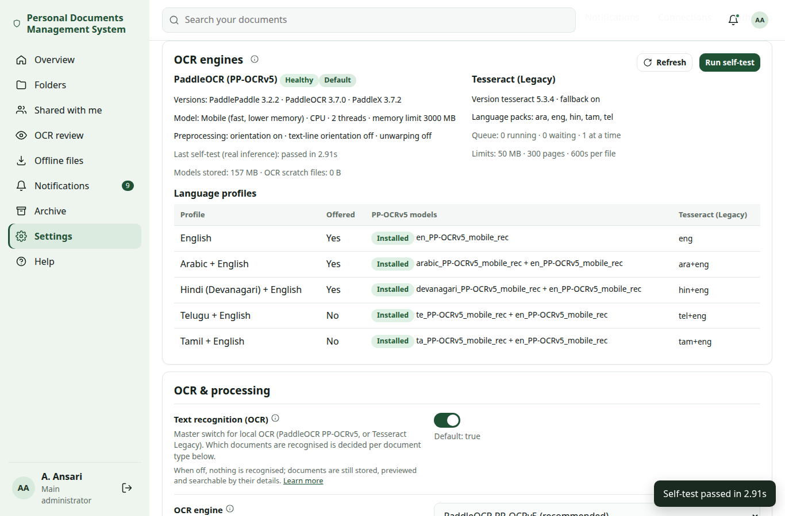
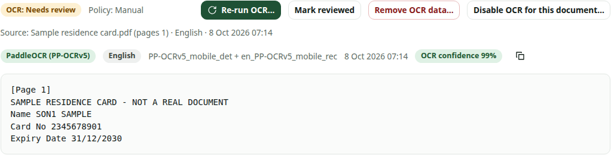
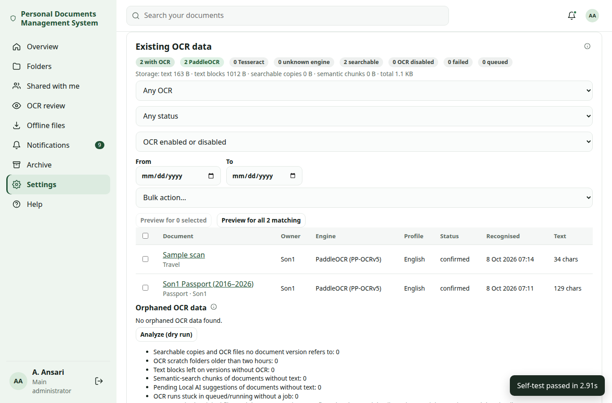
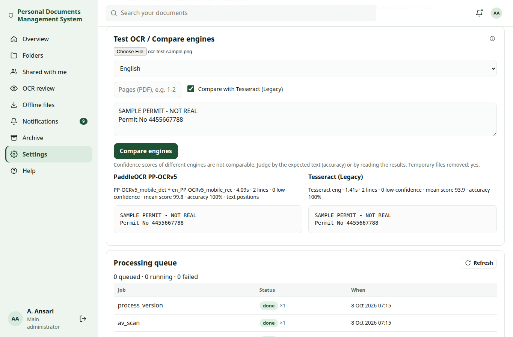

# OCR engines: PaddleOCR (PP-OCRv5) and Tesseract (Legacy)

Since Change Set Q, text recognition uses **PaddleOCR with the PP-OCRv5 models** by default. **Tesseract** stays
installed as the *Legacy / Fallback* engine. Both run **locally on your server**. No image, page or text is sent
to an external OCR service.

This guide covers the engines, the language profiles, removing and disabling OCR, the administrator's **Existing
OCR data** tools, and *Test OCR / Compare engines*. Choosing files and pages, the review queue and suggested details
are described in [OCR, details and corrections](ocr-corrections.md).

## Engines {#engine}

| Engine | Use | Notes |
| --- | --- | --- |
| **PaddleOCR (PP-OCRv5)** — default | All new OCR runs | Better on photos, skewed or curved pages, mixed scripts and small text. Stores text **positions** (boxes) and a score per line. Runs in its own isolated Python environment (`/opt/personaldocs/paddle-venv`), on CPU, one job at a time. |
| **Tesseract (Legacy)** | Fallback, explicit choice, comparison | The engine every earlier release used. It also produces the searchable PDF copy for Tesseract runs. |

Set the default engine in **Settings → OCR & processing → Default OCR engine**. Changing it affects **new OCR runs
only**. Existing results keep their engine label and are never re-processed automatically. Use *Re-process with
PP-OCRv5* in [Existing OCR data](#existing-data) when you decide to upgrade older results.

Every OCR result shows **which engine** produced it (badge in the *Text (OCR)* tab), the model, the language
profile and when it ran. Results from releases before Change Set Q are labelled *Tesseract (Legacy)* when that is
known, or *Unknown (earlier version)*. Old results are never relabelled as PaddleOCR.

### Fallback {#fallback}

When **Fall back to Tesseract** is on (default) and PaddleOCR is not installed, not healthy or missing a model, a
run that did not ask for a specific engine uses Tesseract. The run records that it fell back and why. A run that
explicitly asked for PaddleOCR fails visibly instead. Turn fallback off if you prefer a clear failure over a
Tesseract result.

### Health and self-test {#health}

*Healthy* means **real inference worked**: the self-test generates a small image, recognises it with the
installed PP-OCRv5 models and checks the text. A Python import that succeeds is not enough. The *OCR engines* card
in **Settings → OCR & processing** shows:

- the versions, the CPU (AVX), the model variant, the threads and the memory limit;
- missing models, the last self-test result and its duration;
- the Tesseract version and its language packs;
- the queue and the limits.

**Run self-test** repeats it. On the server: `sudo personaldocs ocr status`, `sudo personaldocs ocr selftest` and
`sudo personaldocs doctor`.

## Language profiles {#profiles}

PaddleOCR reads scripts through language **profiles**. Each profile runs the matching PP-OCRv5 recognition models
and merges their lines:

| Profile | PP-OCRv5 models | Tesseract (Legacy) equivalent |
| --- | --- | --- |
| English | `en_PP-OCRv5_mobile_rec` | `eng` |
| Arabic + English | `arabic_PP-OCRv5_mobile_rec` + English | `ara+eng` |
| Hindi (Devanagari) + English | `devanagari_PP-OCRv5_mobile_rec` + English | `hin+eng` |
| Telugu + English | `te_PP-OCRv5_mobile_rec` + English | `tel+eng` |
| Tamil + English | `ta_PP-OCRv5_mobile_rec` + English | `tam+eng` |

**Offered language profiles** decides which profiles people can choose (English, Arabic + English and Hindi +
English by default). The profile used for a run is chosen in this order:

1. the one picked in *Run OCR…*;
2. the document's last profile;
3. the document type's profile;
4. **Default language profile**.

Models are downloaded once, at install or upgrade time, into `/var/lib/personaldocs/paddle`. They are never
downloaded while a document is being recognised. `sudo personaldocs ocr install-models` installs the models of
every offered profile after you offer a new one.

## Advanced settings {#advanced}

| Setting | Default | Effect |
| --- | --- | --- |
| PaddleOCR model | Mobile | *Server* is slightly more accurate on dense pages but needs about 2× the time and memory. |
| CPU threads | 2 | Threads per OCR job. Keep at 2 on a 6 GB / 4 vCPU server so the web app stays responsive. |
| Memory limit (MB) | 3000 | Hard limit for one OCR job. The worker service itself is capped at 4 GB (`MemoryMax=4000M`). |

### Preprocessing {#preprocessing}

- **Document orientation** (default on) turns pages that are upside down or sideways.
- **Text-line orientation** (default **off**) turns individual upside-down lines. In the benchmark it misread every line of a synthetic Hindi + English card as upside down (20 % instead of 100 % character accuracy), so enable it only for pages that really mix line directions.
- **Unwarping** (default off) flattens curved pages and photos of open books. It is slower and can distort flat
  scans, so enable it only if you scan bound documents.

Only the working copy is changed. The original file never is.

### Limits {#limits}

PaddleOCR jobs share the heavy-job queue with conversions (one at a time by default), the per-file size and page
limits, and the processing timeout. A job that crashes, times out or reaches its memory limit fails **once**, with
a clear message. It is not retried three times. The previous OCR result of that document stays untouched.

## Running, re-running and viewing OCR {#lifecycle}

Open a document, then **⋮ More actions**:

- **Run OCR… / Re-run OCR…** — choose the source files and pages, the engine (PaddleOCR or Tesseract) and the
  language profile (Tesseract: languages). A re-run is **staged**: the new result replaces the old one only after
  every chosen source succeeded. If it fails, the previous text, search entries and searchable copy stay as they
  were.
- **View OCR text** — the *Text (OCR)* tab, with the engine, model, profile, date and confidence of each result.
- **Remove OCR data…** — see below.
- **Disable OCR for this document… / Enable OCR for this document**.

Confirmed details are never overwritten by a re-run. A different reading is shown next to them for review.

## Removing OCR data {#remove}

**Remove OCR data…** deletes everything that was derived from recognition:

- the recognised text, text positions/blocks and confidence values;
- every searchable PDF copy of the document, including stale ones;
- the search-index entries built from that text;
- details that were only *suggested*, and raw OCR excerpts stored next to confirmed details;
- Local AI suggestions and semantic-search chunks built from the text, plus queued Local AI work for the document.

Kept: the **original file and every version**, the title, type, owner, folder, permissions, notes, tags,
manually entered and confirmed details, and the audit history. The audit entry records *what* was removed
(counts, engines). It never records the removed text.

**Also hide the text layer embedded in the file** covers PDFs that already contain text from a scanner or an
earlier OCR program. That text is then no longer used for search either. The file itself is not modified.

After removal the document is not found by words that came only from OCR. A job that was already running when you
removed the data discards its result, so removed text cannot come back.

## Disabling OCR for one document {#disable}

**Disable OCR for this document…** overrides the document type. Nothing recognises the document again until you
choose **Enable OCR for this document**: not an *Automatic* type, *Regenerate preview*, an integrity repair, or a
bulk re-process. You decide whether the existing OCR text is **kept** (it stays searchable) or **removed** at the
same time.

## Existing OCR data (administrator) {#existing-data}

**Settings → OCR & processing → Existing OCR data** lists every document with OCR, with counts by engine
(PaddleOCR, Tesseract, unknown), searchable, disabled, failed and queued documents, and the storage used:

- text;
- text blocks;
- searchable copies;
- semantic chunks.

Filter by engine, status, OCR disabled, and recognition date.

**Bulk actions** apply to the selected documents or to everything matching the filters:

- Remove OCR data
- Remove and disable OCR
- Disable OCR
- Enable OCR
- Re-process with PP-OCRv5
- Set language profile

Every bulk action first shows a **preview**: how many documents are affected, how many have OCR text, the storage
that would be reclaimed, and what is kept. Nothing happens until you confirm.

Bulk work runs in the background in batches. *Re-process* adds documents to the OCR queue only as fast as it
accepts them, so a large library never floods the server. Each re-processed document keeps its previous result
until the new PP-OCRv5 result succeeds.

## Orphaned OCR data {#orphans}

**Analyze (dry run)** lists derived OCR data that no longer belongs to anything:

- searchable copies and OCR files that no version refers to;
- OCR scratch folders older than two hours, but only while no OCR job is running;
- text blocks left on versions without OCR;
- semantic chunks and pending AI suggestions of documents without text;
- OCR runs stuck without a job.

**Clean** removes exactly those items, after a confirmation. Originals, versions, confirmed details, previews,
thumbnails and running jobs are never touched. The same totals appear in **Security Health → Storage**: OCR text,
OCR cache, OCR orphans and OCR models.

## Test OCR / Compare engines (administrator) {#test}

Upload a **sanitised** sample (never a real passport or ID). Choose a profile and, for PDFs, pages. Optionally
compare with Tesseract and paste the expected text. The result shows, per engine:

- the model, the time, the lines and the low-confidence lines;
- the **character accuracy** against your expected text;
- the recognised text.

The test file is processed in a private temporary folder that is always deleted. It is never added to the library.
Engine confidences are not comparable with each other; judge by the accuracy or by reading the text.

## Server commands {#commands}

| Command | Purpose |
| --- | --- |
| `sudo personaldocs ocr status` | Versions, models, AVX, health. |
| `sudo personaldocs ocr selftest` | Real inference self-test. |
| `sudo personaldocs ocr install-models` | Install the models of every offered profile (after offering a new one). |
| `sudo personaldocs ocr reinstall` | Rebuild the PaddleOCR environment from the pinned requirements. |
| `sudo personaldocs install --without-paddleocr` | Install or upgrade without PaddleOCR (Tesseract only). |

Requirements:

- a CPU with **AVX**;
- about **1.3 GB** of disk for the environment and **60–160 MB** for the models (mobile models of all five profiles: about 60 MB; the server detection model adds 85 MB);
- up to about **1.9 GB of RAM** per running OCR job (measured peak with mobile models; see the [benchmark](../OCR_BENCHMARK.md#engines)).

A 6 GB / 4 vCPU server runs it with the default settings.
