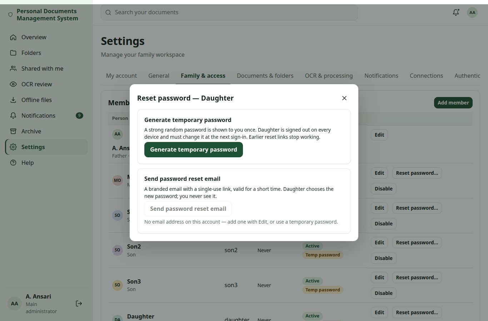

# Password reset

There are three ways to get back into an account when the password is forgotten:

- **Forgot password?** on the sign-in page sends you a reset link by email (you do it yourself).
- An **administrator sends you a password reset email** with the same kind of link.
- An **administrator generates a temporary password** and gives it to you in person or through another channel you
  agreed on. You choose a new password at the next sign-in.

For lost passkeys or authenticator apps, see [lost passkey and recovery](passkeys.md#recovery). If the main
administrator is locked out, see [main administrator lockout](totp-recovery.md#console-recovery).

Examples use the demo labels A. Ansari (main administrator), Mom, Son1, Son2, Son3 and Daughter and the address
`https://docs.example.com`.

## For family members {#members}

### Forgot password? {#forgot}

On the sign-in page, click **Forgot password?** and enter your username or email address. If your account has an email
address and the administrator has set up email, you receive a message **Reset your password** with a button. Use it
within the time shown (30 minutes by default) and choose a new password.

- The link works **once**. Asking again, or changing your password in another way, makes older links stop working.
- The page never says whether an account exists, so the answer is the same for every name you type ("If the account
  has a registered email address, a reset link has been sent…").
- When the reset is done you get the notice **Password reset completed**.

If no email arrives, check your spam folder, then ask your administrator (see [troubleshooting](#troubleshooting)).

### A temporary password from your administrator {#temporary}

Your administrator may give you a temporary password, for example on paper or by phone. Sign in with your username
(or email address) and that password. The app then asks you to **choose a new password** before you can continue.

- The temporary password works only until you replace it.
- When it was issued, you were **signed out on every device**.
- You receive the notice **Temporary password issued**. It never contains the password itself. If you did not expect
  it, contact the family administrator at once.
- After you choose your new password you receive **Password reset completed**.

### Security notices you may receive {#notices}

| Notice | When |
|---|---|
| **Password reset requested** | A reset link was sent to your email address, by you or an administrator |
| **Administrator reset your password** | An administrator started a reset for your account |
| **Temporary password issued** | An administrator issued a temporary password for you |
| **Password reset completed** | Your password was changed, reset with a link, or the temporary password was replaced |
| **Account locked** | Sign-in to your account was paused after repeated failed attempts |

Each one has a protected security note, for example *"If you did not ask for a password reset, ignore the link — your
password stays the same — and tell the family administrator."* These notes are always shown and cannot be removed by
a template. See [security templates](notifications.md#security-templates).

## For administrators {#admins}

### Who can reset whom {#who}

| You are | You can reset |
|---|---|
| Main administrator (Settings → Family & access) | Every other account, including another main administrator |
| Administrator role (Settings → Users) | Every other account **except a main administrator**: the row shows **Protected** |
| Family member | Nobody |

Nobody resets their own password here; use **My account → Password & security → Change password**. A disabled account
must be enabled first. If no main administrator can sign in, use the server console:
`sudo personaldocs recover-admin USERNAME` (see [console recovery](totp-recovery.md#console-recovery)).

### Reset password… {#dialog}

Open **Settings → Family & access** (or **Settings → Users**), find the person's row and click **Reset password…**. If
you have not confirmed it's you in the last few minutes, the **Confirm it's you** dialog asks for your password or a
passkey first. The dialog offers two methods.

#### Generate temporary password {#generate}

1. Click **Generate temporary password**.
2. A 16-character random password is shown **once**, with a **Copy** button.
3. Pass it to the person through a safe channel (in person, by phone). Never send it by email or chat.
4. Click **Done — I have passed it on**. The password can never be shown again.

What happens:
- Only the password **hash** is stored. The password itself is never saved, logged or emailed.
- The person must choose a new password at the next sign-in.
- All the person's sessions end on **every device**. This is not optional: a changed password always ends the
  sessions.
- Earlier reset links of that person stop working.
- The person receives **Temporary password issued** (without the password); other main administrators are told too.
- The audit log records `family.password_reset_by_admin` with who did it, for whom, when and the method
  (`temporary_password`), never the password.

Lost the temporary password before passing it on? Generate a new one; the earlier one stops working.

#### Send password reset email {#email}

1. Click **Send password reset email**. The button is available only when the account has an email address.
2. The person receives a branded email (HTML with a plain-text part) with a single-use link
   `https://docs.example.com/reset-password?token=…`, valid for **Password reset link lifetime**
   (`auth.reset_token_minutes`, default 30 minutes, 5–1440).

What happens:
- The person's current password keeps working until they choose a new one.
- The link works once. A newer request, or any password change, makes older links stop working.
- The link is sent **directly by email**. It is never stored in the notification outbox, the in-app history,
  Telegram, push or any log.
- The person receives **Administrator reset your password** in the app, and **Password reset completed** after the
  reset.
- The audit log records `family.password_reset_email`.

Requirements: SMTP must be configured (Settings → Notifications → Email) and the account needs an email address. When
**Deployment exposure** (`security.deployment`) is *Published on the Internet*, reset links are only sent when
`PD_PUBLIC_ORIGIN` is an `https://` address. The self-service **Forgot password?** uses the same email and the same
rules.

### API {#api}

`POST /api/family/members/<id>/reset-password` with `{"method": "temporary"}` or `{"method": "email"}` (administrators,
recent confirmation required). For `temporary` the response contains `temporary_password` once and is sent with
`Cache-Control: no-store`. Resetting a main administrator as an Administrator returns 403 with a hint to use
`sudo personaldocs recover-admin USERNAME`.

## Troubleshooting {#troubleshooting}

| Problem | What to do |
|---|---|
| The reset email does not arrive | Check spam. Check that the account has an email address, that SMTP works (**Send test email to me** in the email settings) and the error shown in the dialog. On an Internet deployment `PD_PUBLIC_ORIGIN` must be `https://` |
| "This reset link is invalid, was already used or has expired" | It was used already, a newer link was requested, the password was changed, or the time ran out. Ask for a new link |
| The temporary password was lost | Generate a new one; the earlier one stops working |
| **Send password reset email** is greyed out | The account has no email address; add one, or generate a temporary password |
| The row shows **Protected** | Only a main administrator can reset a main administrator's password |
| The person was signed out everywhere | Expected after a temporary password: all sessions end |
